# Bigness: AI-Powered Social Media Content Generation for Brands

> **Build smarter social media content with AI.** Bigness automates trend detection, copy generation, graphic creation, and performance optimization—all at zero cost.

**Status:** MVP Development (Week 1-4 Timeline)  
**Demo:** [Coming Soon]  
**Docs:** [Full Development Timeline](#-development-flow-timeline)

---

## 🎯 Development Flow Timeline

```mermaid
graph TD
  %%{init: {'theme':'dark'}}%%
  graph LR
  A1([<i class='fa fa-cogs'></i><br/>Phase 1<br/>Foundation Setup<br/>2-3h]) --> A2([<i class='fa fa-server'></i><br/>Phase 2<br/>Backend Boilerplate<br/>1d]) --> A3([<i class='fa fa-database'></i><br/>Phase 3<br/>Database Models<br/>1d]) --> A4([<i class='fa fa-user-shield'></i><br/>Phase 4<br/>Auth System<br/>1d]) --> A5([<i class='fa fa-id-card'></i><br/>Phase 5<br/>Brand Management<br/>1d]) --> A6([<i class='fa fa-chart-line'></i><br/>Phase 6<br/>Trend Detection<br/>2d]) --> A7([<i class='fa fa-keyboard'></i><br/>Phase 7<br/>Copy Generation<br/>2d]) --> A8([<i class='fa fa-image'></i><br/>Phase 8<br/>Graphic Generation<br/>2d]) --> A9([<i class='fa fa-tasks'></i><br/>Phase 9<br/>Post Management<br/>1.5d]) --> A10([<i class='fa fa-share-square'></i><br/>Phase 10<br/>Publishing<br/>1.5d]) --> A11([<i class='fa fa-chart-bar'></i><br/>Phase 11<br/>Engagement Tracking<br/>2d]) --> A12([<i class='fa fa-robot'></i><br/>Phase 12<br/>RL System<br/>2d]) --> A13([<i class='fa fa-desktop'></i><br/>Phase 13<br/>Frontend Boilerplate<br/>1d]) --> A14([<i class='fa fa-pencil-ruler'></i><br/>Phase 14<br/>Post Gen UI<br/>2d]) --> A15([<i class='fa fa-chart-pie'></i><br/>Phase 15<br/>Analytics Dashboard<br/>2d]) --> A16([<i class='fa fa-cloud-upload-alt'></i><br/>Phase 16<br/>Deployment<br/>1d]) --> A17([<i class='fa fa-users'></i><br/>Phase 17<br/>Beta Testing<br/>2-3d])
  %% Arrow style for infographic look
  linkStyle default stroke:#fff,stroke-width:4px
  style A1 fill:#ffa726,stroke:#fff,stroke-width:2px,color:#fff
  style A2 fill:#66bb6a,stroke:#fff,stroke-width:2px,color:#fff
  style A3 fill:#29b6f6,stroke:#fff,stroke-width:2px,color:#fff
  style A4 fill:#5c6bc0,stroke:#fff,stroke-width:2px,color:#fff
  style A5 fill:#ab47bc,stroke:#fff,stroke-width:2px,color:#fff
  style A6 fill:#ec407a,stroke:#fff,stroke-width:2px,color:#fff
  style A7 fill:#ff7043,stroke:#fff,stroke-width:2px,color:#fff
  style A8 fill:#26a69a,stroke:#fff,stroke-width:2px,color:#fff
  style A9 fill:#8d6e63,stroke:#fff,stroke-width:2px,color:#fff
  style A10 fill:#d4e157,stroke:#fff,stroke-width:2px,color:#fff
  style A11 fill:#42a5f5,stroke:#fff,stroke-width:2px,color:#fff
  style A12 fill:#7e57c2,stroke:#fff,stroke-width:2px,color:#fff
  style A13 fill:#26c6da,stroke:#fff,stroke-width:2px,color:#fff
  style A14 fill:#ef5350,stroke:#fff,stroke-width:2px,color:#fff
  style A15 fill:#8bc34a,stroke:#fff,stroke-width:2px,color:#fff
  style A16 fill:#ffa726,stroke:#fff,stroke-width:2px,color:#fff
  style A17 fill:#ec407a,stroke:#fff,stroke-width:2px,color:#fff
```

## Core Principle
Build in **layers of dependency**, not in time-based sprints. Each phase depends on successful completion of previous phases. This ensures you never build on unstable foundations.

---

## 📊 DEVELOPMENT FLOW (Conservative, Dependency-Based)

### **PHASE 1: FOUNDATION SETUP** 
*Before writing ANY code. Prerequisite: Nothing.*

```
├─ Step 1: Create all free service accounts
│  ├─ GitHub (code hosting)
│  ├─ MongoDB Atlas (database)
│  ├─ Redis Cloud (caching)
│  ├─ Groq API (LLM)
│  ├─ Stability AI (image generation)
│  ├─ Cloudinary (CDN)
│  ├─ Twitter API v2 (trend detection)
│  ├─ NewsAPI (headlines)
│  ├─ Vercel (frontend hosting)
│  ├─ Railway (backend hosting)
│  └─ Sentry (error tracking)
│
├─ Step 2: Verify each service works
│  ├─ Test MongoDB connection
│  ├─ Test Redis connection
│  ├─ Test Groq API with sample request
│  ├─ Test Twitter API with sample query
│  ├─ Test NewsAPI with sample request
│  └─ Test Cloudinary upload
│
└─ Step 3: Collect & organize all credentials
   └─ Create .env file with ALL keys (local only)
```

**✅ Exit Criteria:** All 11 services confirmed working, .env file complete, no hardcoded secrets

**Duration:** 2-3 hours (mostly waiting for Twitter API approval)

---

### **PHASE 2: LOCAL BACKEND BOILERPLATE**
*Prerequisite: Phase 1 complete. Goal: Get Node.js server running.*

```
├─ Step 1: Initialize Node.js project
│  ├─ Create backend/ folder
│  ├─ npm init -y
│  ├─ Install core dependencies (express, mongoose, cors, helmet, dotenv, jwt, bcrypt)
│  ├─ Install AI clients (groq-sdk, axios, cloudinary)
│  ├─ Install caching (redis, ioredis, bull)
│  └─ Install utilities (node-schedule, twitter-api-v2, @sentry/node)
│
├─ Step 2: Create folder structure
│  ├─ mkdir models, routes, middleware, services, jobs, utils, config
│  └─ Create .env file from template
│
├─ Step 3: Create minimal server.js
│  ├─ Express app with middleware (helmet, cors, express.json)
│  ├─ Sentry initialization
│  ├─ MongoDB connection logic
│  ├─ Single test route: GET /api/health
│  └─ Error handling middleware
│
├─ Step 4: Test locally
│  ├─ npm start (or nodemon)
│  ├─ curl http://localhost:5000/api/health
│  └─ Confirm: {"status":"OK","timestamp":"..."}
│
└─ Step 5: Connect MongoDB
   ├─ Test connection from server.js
   └─ Confirm: "✅ MongoDB connected" in logs
```

**✅ Exit Criteria:** Server runs locally, /api/health works, MongoDB connected

**Dependency:** Phase 1 complete

---

### **PHASE 3: DATABASE MODELS**
*Prerequisite: Phase 2 complete. Goal: Define all data structures.*

```
├─ Step 1: Create User model
│  ├─ Fields: email, password, role (brand/influencer), createdAt
│  ├─ Add: Password hashing middleware (bcrypt)
│  ├─ Add: Password comparison method
│  └─ Test: Create & retrieve user in MongoDB
│
├─ Step 2: Create BrandProfile model
│  ├─ Fields: userId, name, industry, brandIdentity, targetAudience, socialAccounts, contentPreferences, pastPosts
│  ├─ Add: Relationship to User model
│  └─ Test: Create brand for existing user
│
├─ Step 3: Create Trend model
│  ├─ Fields: topic, industries, platform, data (volume, momentum, sentiment), detectedAt, expiresAt
│  ├─ Add: TTL index (auto-delete after 30 days)
│  └─ Test: Create & query trends
│
├─ Step 4: Create GeneratedPost model
│  ├─ Fields: brandId, trendId, content (copy, platform, format), graphics, status, engagement, rlReward
│  ├─ Add: Relationships to Brand & Trend
│  ├─ Add: Index on brandId+createdAt for fast queries
│  └─ Test: Create post with relationships
│
└─ Step 5: Add database indexes
   ├─ brandId_createdAt (for fast post lookups)
   ├─ status_publishedAt (for engagement tracking)
   ├─ publishedAt_rlReward (for analytics)
   └─ TTL index on Trend.expiresAt
```

**✅ Exit Criteria:** All 4 models created & tested, indexes added, sample data in MongoDB

**Dependency:** Phase 2 complete

---

### **PHASE 4: AUTHENTICATION SYSTEM**
*Prerequisite: Phase 3 complete. Goal: Users can register & login.*

```
├─ Step 1: Create auth middleware
│  ├─ JWT token extraction from headers
│  ├─ Token verification logic
│  ├─ Set req.userId and req.role
│  └─ Test: Middleware blocks requests without token
│
├─ Step 2: Create auth routes (/api/v1/auth)
│  ├─ POST /register
│  │  ├─ Accept: email, password, role
│  │  ├─ Validate: email format, password strength
│  │  ├─ Check: User doesn't already exist
│  │  ├─ Hash password with bcrypt
│  │  ├─ Create User record
│  │  ├─ Generate JWT token
│  │  └─ Return: token, userId, role
│  │
│  └─ POST /login
│     ├─ Accept: email, password
│     ├─ Find user by email
│     ├─ Compare password hash
│     ├─ Generate JWT token
│     └─ Return: token, userId, role
│
├─ Step 3: Test locally
│  ├─ POST /api/v1/auth/register with test email
│  ├─ Verify: Token returned, user in DB
│  ├─ POST /api/v1/auth/login with same credentials
│  ├─ Verify: Same token works
│  └─ Test: Protected routes reject requests without token
│
└─ Step 4: Test token expiry
   ├─ Create token with 7-day expiry
   └─ Verify: Expired tokens get rejected
```

**✅ Exit Criteria:** Register & login working, JWT tokens valid, protected routes secured

**Dependency:** Phase 3 complete

---

### **PHASE 5: BRAND MANAGEMENT ROUTES**
*Prerequisite: Phase 4 complete. Goal: Brands can create & update profiles.*

```
├─ Step 1: Create brand routes (/api/v1/brands)
│  ├─ POST /
│  │  ├─ Auth required (must be logged in)
│  │  ├─ Accept: name, industry, brandIdentity, targetAudience, contentPreferences
│  │  ├─ Create BrandProfile linked to current user
│  │  └─ Return: brandId
│  │
│  ├─ GET /:brandId
│  │  ├─ Auth required
│  │  ├─ Return: Full brand profile
│  │  ├─ Test: Can fetch own brand
│  │  └─ Verify: Other users can't access
│  │
│  ├─ PUT /:brandId
│  │  ├─ Auth required (must own brand)
│  │  ├─ Accept: Updates to any brand fields
│  │  ├─ Update BrandProfile
│  │  └─ Return: Updated profile
│  │
│  └─ DELETE /:brandId
│     ├─ Auth required (must own brand)
│     ├─ Delete BrandProfile
│     └─ Return: Success message
│
├─ Step 2: Add authorization checks
│  ├─ Only brand owner can update/delete their brand
│  ├─ Test: Other users can't modify brands they don't own
│  └─ Test: Proper error messages returned
│
└─ Step 3: Test full flow
   ├─ Register user
   ├─ Create brand profile
   ├─ Update brand profile
   ├─ Delete brand profile
   └─ Verify: All changes persisted to DB
```

**✅ Exit Criteria:** Full CRUD operations for brands working, authorization enforced

**Dependency:** Phase 4 complete

---

### **PHASE 6: TREND DETECTION SYSTEM**
*Prerequisite: Phase 5 complete. Goal: Pull trends from multiple sources.*

```
├─ Step 1: Create TrendDetector service
│  ├─ Implement fetchTwitterTrends()
│  │  ├─ Query Twitter API v2 for recent tweets
│  │  ├─ Filter: exclude retweets, fintech/startup/AI keywords
│  │  ├─ Extract: topic, volume, momentum, sentiment
│  │  └─ Test: Returns valid trend objects
│  │
│  ├─ Implement fetchNewsTrends()
│  │  ├─ Query NewsAPI for business headlines
│  │  ├─ Extract: title, source, sentiment
│  │  └─ Test: Returns valid trend objects
│  │
│  └─ Implement saveTrends()
│     ├─ Upsert trends to MongoDB (avoid duplicates)
│     ├─ Add expiresAt timestamp (30 days)
│     └─ Test: Trends saved to DB
│
├─ Step 2: Create trend routes (/api/v1/trends)
│  ├─ GET /
│  │  ├─ Return: Top 50 most recent trends
│  │  ├─ Sort by detectedAt descending
│  │  ├─ Use pagination (limit 50)
│  │  └─ Test: Returns array of trends
│  │
│  └─ GET /:trendId
│     ├─ Return: Single trend by ID
│     └─ Test: Fetch specific trend
│
├─ Step 3: Create trend detection job
│  ├─ Schedule: Run every 6 hours via node-schedule
│  ├─ Logic:
│  │  ├─ Fetch from Twitter + NewsAPI
│  │  ├─ Deduplicate
│  │  ├─ Save to DB
│  │  └─ Log results
│  └─ Test: Job runs without errors
│
├─ Step 4: Test locally (manual trigger)
│  ├─ Call trendDetector.run() manually
│  ├─ Verify: Trends appear in MongoDB
│  ├─ Verify: GET /api/v1/trends returns them
│  └─ Wait 6+ hours OR trigger manually 2+ times to test scheduling
│
└─ Step 5: Add caching layer
   ├─ Cache trends in Redis for 6 hours
   ├─ Invalidate cache when new trends added
   └─ Test: Second request uses cache (faster)
```

**✅ Exit Criteria:** Trends fetched from multiple sources, stored in DB, retrieved via API, job scheduled

**Dependency:** Phase 5 complete

---

### **PHASE 7: COPY GENERATION (LLM)**
*Prerequisite: Phase 6 complete. Goal: Generate social media copy using Groq.*

```
├─ Step 1: Create CopyGenerator service
│  ├─ Implement buildSystemPrompt(brand)
│  │  ├─ Include: brand name, industry, tone, messaging pillars, target audience
│  │  └─ Test: Produces well-structured prompt
│  │
│  ├─ Implement buildUserPrompt(trend, platform)
│  │  ├─ Include: trend topic, platform (Twitter/LinkedIn), word limits
│  │  └─ Test: Platform-specific prompts differ
│  │
│  ├─ Implement generate(brandId, trend, platform)
│  │  ├─ Get brand profile
│  │  ├─ Build system + user prompts
│  │  ├─ Call Groq API (mixtral-8x7b-32768 model)
│  │  ├─ Handle errors gracefully (fallback templates)
│  │  └─ Return generated copy
│  │
│  ├─ Implement getFallbackCopy(trend, brand)
│  │  ├─ Return simple template copy if Groq fails
│  │  └─ Test: Returns reasonable copy
│  │
│  └─ Test: Single generation call works end-to-end
│
├─ Step 2: Create copy generation route (/api/v1/posts)
│  ├─ POST /:brandId/generate
│  │  ├─ Auth required
│  │  ├─ Accept: trendId, platform
│  │  ├─ Fetch trend & brand
│  │  ├─ Call CopyGenerator.generate()
│  │  ├─ Create draft GeneratedPost with copy
│  │  ├─ Save to DB
│  │  └─ Return: postId, copy
│  │
│  └─ Test: Generate copy for real trend
│
├─ Step 3: Add caching to reduce API calls
│  ├─ Check Redis before calling Groq
│  ├─ Cache generated copy for 24 hours
│  ├─ Reuse similar past posts if available
│  └─ Test: Subsequent requests use cache
│
└─ Step 4: Test quality & fallback
   ├─ Test: Groq generates reasonable copy
   ├─ Test: Fallback works when Groq fails
   └─ Manually verify: 5+ generated copies read naturally
```

**✅ Exit Criteria:** Copy generates from Groq, fallbacks work, caching implemented, quality verified

**Dependency:** Phase 6 complete

---

### **PHASE 8: GRAPHIC GENERATION (STABILITY AI)**
*Prerequisite: Phase 7 complete. Goal: Generate graphics to accompany copy.*

```
├─ Step 1: Create GraphicGenerator service
│  ├─ Implement buildPrompt(brand, copy)
│  │  ├─ Include: brand name, tone, colors, copy excerpt
│  │  ├─ Request: 1200x630px or 1080x1920px dimensions
│  │  └─ Test: Produces Stability AI-compatible prompt
│  │
│  ├─ Implement generate(brandId, copy, platform)
│  │  ├─ Get brand assets
│  │  ├─ Build image prompt
│  │  ├─ Call Stability AI API
│  │  ├─ Handle errors gracefully (template fallback)
│  │  └─ Return image URL
│  │
│  ├─ Implement uploadToCloudinary(imageBuffer, brandId)
│  │  ├─ Upload Stability AI output to Cloudinary
│  │  ├─ Store in: bigness/{brandId}/ folder
│  │  ├─ Get CDN URL
│  │  └─ Return secure_url
│  │
│  ├─ Implement getFallbackGraphic(copy, brand)
│  │  ├─ Generate simple placeholder image URL
│  │  ├─ Use brand colors + text overlay
│  │  └─ Return immediately (zero API cost)
│  │
│  └─ Test: Single generation call works end-to-end
│
├─ Step 2: Update post generation route
│  ├─ POST /:brandId/generate now:
│  │  ├─ Generate copy (Phase 7)
│  │  ├─ Generate graphic (Phase 8)
│  │  ├─ Create GeneratedPost with BOTH
│  │  ├─ Store graphics array with URL
│  │  └─ Return: postId, copy, graphicUrl
│  │
│  └─ Test: Complete post preview with image
│
├─ Step 3: Add intelligent tiering
│  ├─ TIER 1 (Free): Use template fallback (instant, no cost)
│  ├─ TIER 2 (Starter): Enhanced template with brand assets (fast, no cost)
│  └─ TIER 3 (Pro): Call Stability AI (slower, uses free credits)
│
├─ Step 4: Add caching to reduce API calls
│  ├─ Cache graphic URLs for 24 hours
│  ├─ Check if similar post already has graphic
│  ├─ Reuse existing graphics (zero API cost)
│  └─ Test: Subsequent requests use cache
│
└─ Step 5: Test quality & fallback
   ├─ Test: Stability AI generates reasonable graphics
   ├─ Test: Fallback works when Stability AI fails
   └─ Manually verify: 5+ generated graphics look professional
```

**✅ Exit Criteria:** Graphics generate from Stability AI, fallbacks work, caching implemented, images display correctly

**Dependency:** Phase 7 complete

---

### **PHASE 9: POST MANAGEMENT**
*Prerequisite: Phase 8 complete. Goal: Brands can manage draft/scheduled/published posts.*

```
├─ Step 1: Update posts routes (/api/v1/posts)
│  ├─ GET /:brandId/posts
│  │  ├─ Auth required
│  │  ├─ Filter by brandId
│  │  ├─ Sort by createdAt descending
│  │  ├─ Add pagination (default limit 20)
│  │  └─ Return: Array of posts
│  │
│  ├─ PUT /:brandId/posts/:postId
│  │  ├─ Auth required (must own brand)
│  │  ├─ Accept: Updates to copy, graphics, scheduledAt
│  │  ├─ Update GeneratedPost
│  │  └─ Return: Updated post
│  │
│  ├─ DELETE /:brandId/posts/:postId
│  │  ├─ Auth required (must own brand)
│  │  ├─ Delete GeneratedPost
│  │  └─ Return: Success message
│  │
│  └─ POST /:brandId/posts/:postId/publish
│     ├─ Auth required (must own brand)
│     ├─ Change status: draft → published
│     ├─ Set publishedAt timestamp
│     └─ Return: Success message (actual publishing in Phase 10)
│
├─ Step 2: Add status management
│  ├─ Statuses: draft → scheduled → published
│  ├─ Only draft posts can be edited
│  ├─ Only draft/scheduled posts can be deleted
│  └─ Test: Status transitions work correctly
│
├─ Step 3: Add batch operations
│  ├─ POST /:brandId/posts/batch-publish
│  │  ├─ Accept: Array of postIds
│  │  ├─ Update all in single operation
│  │  └─ Return: Number updated
│  │
│  └─ Test: Multiple posts update at once
│
└─ Step 4: Test full post lifecycle
   ├─ Generate post (copy + graphics)
   ├─ Edit post
   ├─ Publish post
   ├─ Delete post
   └─ Verify all data persists correctly
```

**✅ Exit Criteria:** Full post CRUD working, status management working, batch operations working

**Dependency:** Phase 8 complete

---

### **PHASE 10: SOCIAL MEDIA PUBLISHING**
*Prerequisite: Phase 9 complete. Goal: Posts actually go live on Twitter/LinkedIn.*

```
├─ Step 1: Create SocialPublisher service
│  ├─ Implement publishToTwitter(brandId, copy, graphicUrl)
│  │  ├─ Get brand's Twitter credentials
│  │  ├─ Authenticate with Twitter API v2
│  │  ├─ Create tweet with text + image
│  │  ├─ Get tweet ID
│  │  ├─ Return: tweetId, success
│  │
│  ├─ Implement publishToLinkedIn(brandId, copy, graphicUrl)
│  │  ├─ Get brand's LinkedIn credentials (TODO: Implement OAuth)
│  │  ├─ Create post with text + image
│  │  ├─ Get post ID
│  │  ├─ Return: postId, success
│  │
│  └─ Test: Single post publishes successfully
│
├─ Step 2: Update publish route
│  ├─ POST /:brandId/posts/:postId/publish now:
│  │  ├─ Get post & brand
│  │  ├─ Call SocialPublisher based on platform
│  │  ├─ Store postUrl (link to live tweet/post)
│  │  ├─ Update post.status = published
│  │  ├─ Set publishedAt timestamp
│  │  └─ Return: postUrl, message
│  │
│  └─ Test: Post published to real Twitter account
│
├─ Step 3: Add retry logic
│  ├─ If publish fails: Retry with exponential backoff (1s, 2s, 4s, 8s)
│  ├─ Max 3 retries
│  ├─ Store error message if all retries fail
│  └─ Test: Retry logic works (simulate failures)
│
├─ Step 4: Add scheduled publishing
│  ├─ Accept: scheduledAt timestamp
│  ├─ Create background job to publish at specified time
│  ├─ Use Bull queue or node-schedule
│  └─ Test: Post publishes at correct time
│
└─ Step 5: Test end-to-end publishing
   ├─ Generate post
   ├─ Publish post
   ├─ Check Twitter: Post is live
   └─ Verify: Post URL stored in DB
```

**✅ Exit Criteria:** Posts publish to Twitter successfully, scheduled publishing works, retry logic working

**Dependency:** Phase 9 complete

---

### **PHASE 11: ENGAGEMENT TRACKING**
*Prerequisite: Phase 10 complete. Goal: Track post performance metrics.*

```
├─ Step 1: Create EngagementTracker service
│  ├─ Implement trackTwitterEngagement(tweetId, brandId, postId)
│  │  ├─ Call Twitter API to get tweet metrics
│  │  ├─ Extract: likes, retweets, replies, impressions
│  │  ├─ Calculate reward: (likes + 3×replies + 5×retweets) / impressions
│  │  ├─ Normalize to 0-5 scale
│  │  └─ Return: engagement object + reward
│  │
│  ├─ Implement trackLinkedInEngagement(postId, brandId)
│  │  ├─ Query LinkedIn API (limited public data)
│  │  ├─ Extract: available metrics
│  │  ├─ Calculate reward (same formula)
│  │  └─ Return: engagement object + reward
│  │
│  └─ Test: Fetch engagement for published posts
│
├─ Step 2: Create engagement tracking job
│  ├─ Schedule: Run every 4 hours
│  ├─ Logic:
│  │  ├─ Find all published posts from last 30 days
│  │  ├─ For each post: Fetch engagement metrics
│  │  ├─ Update post.engagement & post.rlReward
│  │  ├─ Aggregate brand-level stats
│  │  └─ Store in cache for dashboard
│  └─ Test: Job runs without errors, data updates
│
├─ Step 3: Create engagement API endpoints
│  ├─ GET /:brandId/analytics
│  │  ├─ Return: Total posts, avg engagement rate, best topics, best times
│  │  ├─ Use cached data (very fast)
│  │  └─ Test: Returns aggregated stats
│  │
│  └─ GET /:brandId/posts/:postId/engagement
│     ├─ Return: Detailed engagement for single post
│     └─ Test: Returns metrics
│
└─ Step 4: Test full tracking flow
   ├─ Publish post
   ├─ Wait 4+ hours OR trigger manually
   ├─ Check DB: Engagement data updated
   └─ Check dashboard shows correct analytics
```

**✅ Exit Criteria:** Engagement tracked from Twitter/LinkedIn, reward calculated, analytics endpoint working

**Dependency:** Phase 10 complete

---

### **PHASE 12: REINFORCEMENT LEARNING SYSTEM**
*Prerequisite: Phase 11 complete. Goal: System learns which posts perform best.*

```
├─ Step 1: Create SimpleRL service (Bandit algorithm, not full Q-learning)
│  ├─ Implement SimpleBandit class
│  │  ├─ Tracks: action wins/pulls (win rate)
│  │  ├─ Method: selectAction(availableActions)
│  │  │  ├─ 10% exploration (random action)
│  │  │  ├─ 90% exploitation (best action so far)
│  │  │  └─ Return selected action
│  │  │
│  │  ├─ Method: updateReward(action, reward)
│  │  │  ├─ If reward > 3/5: Count as win
│  │  │  ├─ Update win/pull counts
│  │  │  └─ Calculate win rate
│  │  │
│  │  └─ Method: toJSON()
│  │     └─ Export model for storage
│  │
│  ├─ Test: Bandit selects actions correctly
│  ├─ Test: Win rates calculated correctly
│  ├─ Test: Exploitation wins 90% of time
│  └─ Test: Exploration picks random 10% of time
│
├─ Step 2: Create RL training job
│  ├─ Schedule: Run weekly (Sunday midnight)
│  ├─ Logic for each brand:
│  │  ├─ Fetch all posts from last 30 days
│  │  ├─ For each post: Extract state (industry, platform, tone) & reward
│  │  ├─ Initialize SimpleBandit
│  │  ├─ Train on all posts (update rewards)
│  │  ├─ Save trained model to DB
│  │  └─ Log: "Brand X trained with 45 posts"
│  │
│  └─ Test: Job runs, models saved to DB
│
├─ Step 3: Integrate RL into trend scoring
│  ├─ When recommending trends to brand:
│  │  ├─ Load brand's trained RL model
│  │  ├─ For each trend: Use model to predict best format/tone
│  │  ├─ Score trend based on RL prediction
│  │  ├─ Rank trends by combined score + RL reward
│  │  └─ Return: Top 5 trends with best predicted rewards
│  │
│  └─ Test: RL predictions reasonable
│
├─ Step 4: Create RL stats endpoint
│  ├─ GET /:brandId/rl-stats
│  │  ├─ Return: Win rates for each action, best performing formats, etc.
│  │  └─ Test: Displays RL performance
│  │
│  └─ PUT /:brandId/rl-stats/reset
│     ├─ Reset all RL data for brand
│     └─ Test: RL data cleared
│
└─ Step 5: Test full RL loop
   ├─ Create 20+ posts with varied formats
   ├─ Train RL model
   ├─ Generate new posts: verify they prefer high-reward actions
   └─ Check RL stats show learning
```

**✅ Exit Criteria:** Simple RL system working, learns from post performance, improves recommendations

**Dependency:** Phase 11 complete

---

### **PHASE 13: FRONTEND BOILERPLATE**
*Prerequisite: Phase 6 complete (trends available via API). Goal: Basic React app structure.*

```
├─ Step 1: Initialize React app
│  ├─ npx create-react-app frontend
│  ├─ Install dependencies: axios, react-router-dom, zustand, @tanstack/react-query
│  ├─ Create .env with API_URL
│  └─ Remove boilerplate files
│
├─ Step 2: Create folder structure
│  ├─ pages/ (LoginPage, DashboardPage, SettingsPage, AnalyticsPage)
│  ├─ components/ (Header, Sidebar, Card, Button, FormInput, etc.)
│  ├─ hooks/ (useAuth, useBrand, usePosts)
│  ├─ services/ (API client functions)
│  ├─ utils/ (helpers, constants)
│  ├─ store/ (Zustand state management)
│  └─ App.jsx
│
├─ Step 3: Create API client
│  ├─ File: services/api.js
│  ├─ Functions:
│  │  ├─ api.post('/auth/register', {email, password, role})
│  │  ├─ api.post('/auth/login', {email, password})
│  │  ├─ api.get('/trends')
│  │  ├─ api.post('/brands', {...})
│  │  └─ ... (one function per backend endpoint)
│  │
│  └─ Test: API calls work from React
│
├─ Step 4: Create Zustand store (global state)
│  ├─ File: store/useAuthStore.js
│  ├─ State: { user, token, isLoggedIn, login(), logout(), register() }
│  │
│  └─ File: store/useBrandStore.js
│     ├─ State: { brands, selectedBrand, fetchBrands(), createBrand() }
│     └─ Test: State updates correctly
│
├─ Step 5: Create basic pages
│  ├─ LoginPage
│  │  ├─ Form: email + password input
│  │  ├─ Buttons: Register, Login
│  │  ├─ On submit: Call api.post('/auth/login')
│  │  ├─ On success: Store token, redirect to dashboard
│  │  └─ Test: Login works end-to-end
│  │
│  ├─ DashboardPage
│  │  ├─ Show: Selected brand info
│  │  ├─ Button: Generate new post
│  │  ├─ List: Recent posts (from /api/v1/posts)
│  │  └─ Test: Loads data from API
│  │
│  └─ SettingsPage
│     ├─ Form: Edit brand profile
│     ├─ On submit: Call api.put('/brands/:id')
│     └─ Test: Updates persist
│
├─ Step 6: Create App.js routing
│  ├─ Routes:
│  │  ├─ / → LoginPage (if not logged in)
│  │  ├─ /dashboard → DashboardPage (if logged in)
│  │  ├─ /settings → SettingsPage (if logged in)
│  │  └─ Redirect logic
│  │
│  └─ Test: Routing works, private routes protected
│
└─ Step 7: Test full frontend flow
   ├─ Load localhost:3000
   ├─ Register new user
   ├─ Login
   ├─ Create brand
   ├─ Navigate to dashboard
   └─ Test: All pages load without errors
```

**✅ Exit Criteria:** React app loads, login works, can fetch data from API, routing works

**Dependency:** Phase 6 complete

---

### **PHASE 14: POST GENERATION INTERFACE**
*Prerequisite: Phase 13 complete + Phase 8 complete (graphics generation). Goal: UI for creating posts.*

```
├─ Step 1: Create PostGenerator component
│  ├─ Component: <PostGenerator />
│  ├─ UI:
│  │  ├─ Display: List of trends from API
│  │  ├─ Button: "Generate Post" for each trend
│  │  ├─ Modal/Card: Show post generation status
│  │  └─ Loading spinner during generation
│  │
│  └─ Logic:
│     ├─ On click "Generate Post":
│     │  ├─ Show loading spinner
│     │  ├─ Call api.post('/posts/:brandId/generate', {trendId, platform})
│     │  ├─ Display generated copy + image
│     │  └─ Hide loading spinner
│     │
│     └─ Handle errors gracefully
│
├─ Step 2: Create PostPreview component
│  ├─ Component: <PostPreview post={post} />
│  ├─ UI:
│  │  ├─ Display: Post copy (textarea for editing)
│  │  ├─ Display: Post graphics (image)
│  │  ├─ Show: Platform (Twitter/LinkedIn)
│  │  ├─ Buttons: Edit, Delete, Publish, Schedule
│  │  ├─ Engagement (if published): likes, shares, impressions
│  │  └─ RL score (if available)
│  │
│  └─ Logic:
│     ├─ On "Edit": Allow inline editing
│     ├─ On "Delete": Confirm & call api.delete()
│     ├─ On "Publish": Call api.post('/posts/:id/publish')
│     └─ On "Schedule": Show date/time picker
│
├─ Step 3: Create PostList component
│  ├─ Component: <PostList posts={posts} />
│  ├─ UI:
│  │  ├─ Display: Grid/table of all posts
│  │  ├─ Filter: By status (draft, scheduled, published)
│  │  ├─ Sort: By createdAt, status, engagement
│  │  ├─ Each row: Clickable → opens PostPreview
│  │  └─ Pagination controls
│  │
│  └─ Logic:
│     ├─ Fetch posts on mount: api.get('/posts/:brandId/posts')
│     ├─ Update list on new post/delete/publish
│     └─ Refresh engagement every 5 mins (for live updates)
│
├─ Step 4: Integrate into DashboardPage
│  ├─ Layout:
│  │  ├─ Section 1: TrendList + PostGenerator
│  │  └─ Section 2: PostList
│  │
│  ├─ Flow:
│  │  ├─ User sees trending topics
│  │  ├─ Clicks "Generate"
│  │  ├─ Sees preview
│  │  ├─ Approves and publishes
│  │  └─ Post appears in list
│  │
│  └─ Test: Full post creation flow
│
└─ Step 5: Test end-to-end
   ├─ Load dashboard
   ├─ Select trend
   ├─ Generate post
   ├─ Edit post
   ├─ Publish post
   ├─ Check Twitter: Post is live
   └─ Verify: Engagement shows in UI
```

**✅ Exit Criteria:** Full post generation UI working, posts publish from frontend, engagement shows

**Dependency:** Phase 13 complete + Phase 8 complete

---

### **PHASE 15: ANALYTICS DASHBOARD**
*Prerequisite: Phase 11 complete (engagement tracking). Goal: Show performance metrics.*

```
├─ Step 1: Create AnalyticsPage
│  ├─ Route: /analytics
│  ├─ Sections:
│  │  ├─ Section 1: Overview cards
│  │  │  ├─ Total posts generated
│  │  │  ├─ Total engagement (likes + comments + shares)
│  │  │  ├─ Average engagement rate
│  │  │  └─ Posts this month
│  │  │
│  │  ├─ Section 2: Trends chart
│  │  │  ├─ Show: Posts over time (line chart)
│  │  │  ├─ X-axis: Date
│  │  │  └─ Y-axis: Number of posts
│  │  │
│  │  ├─ Section 3: Top performing topics
│  │  │  ├─ Table: Topic, posts, avg engagement, best post link
│  │  │  └─ Sorted: By engagement descending
│  │  │
│  │  ├─ Section 4: Best posting times
│  │  │  ├─ Heatmap: Hour of day vs. engagement
│  │  │  └─ Show: Peak engagement hours
│  │  │
│  │  ├─ Section 5: Platform comparison
│  │  │  ├─ Twitter vs. LinkedIn performance
│  │  │  └─ Show: Engagement rates by platform
│  │  │
│  │  └─ Section 6: RL performance
│  │     ├─ Show: Learning progress, best actions
│  │     └─ Reset RL button
│  │
│  └─ API calls:
│     ├─ GET /brands/:brandId/analytics (overview)
│     └─ GET /posts/:brandId/posts?status=published (detailed data)
│
├─ Step 2: Create charts using recharts or chart.js
│  ├─ Install: recharts (or chart.js)
│  ├─ Components:
│  │  ├─ <LineChart posts={posts} />
│  │  ├─ <BarChart topics={topics} />
│  │  └─ <HeatmapChart times={engagementByHour} />
│  │
│  └─ Test: Charts render correctly
│
├─ Step 3: Add filters & date range
│  ├─ Date picker: Select date range
│  ├─ Platform filter: Twitter, LinkedIn, All
│  ├─ On change: Refetch analytics
│  └─ Test: Filters work correctly
│
└─ Step 4: Test end-to-end
   ├─ Publish 10+ posts
   ├─ Navigate to analytics
   ├─ Check: Charts show accurate data
   ├─ Test: Filters work
   └─ Verify: RL stats display
```

**✅ Exit Criteria:** Analytics dashboard displays, charts work, filters functional, data accurate

**Dependency:** Phase 11 complete

---

### **PHASE 16: DEPLOYMENT SETUP**
*Prerequisite: All phases 1-15 complete. Goal: Deploy to production for beta testing.*

```
├─ Step 1: Backend deployment (Railway)
│  ├─ Create Railway account (free tier)
│  ├─ Connect GitHub repo
│  ├─ Select backend/ folder
│  ├─ Add MongoDB plugin (Railway-hosted, free)
│  ├─ Add Redis plugin (Railway-hosted, free)
│  ├─ Set environment variables:
│  │  ├─ All API keys (Groq, Stability, Twitter, etc.)
│  │  ├─ JWT_SECRET
│  │  ├─ NODE_ENV=production
│  │  └─ Database URIs (auto-set by Railway)
│  │
│  ├─ Deploy backend
│  ├─ Test: GET /api/health returns 200
│  └─ Note: Backend URL for next step
│
├─ Step 2: Frontend deployment (Vercel)
│  ├─ Create Vercel account (free tier)
│  ├─ Connect GitHub repo
│  ├─ Select frontend/ folder
│  ├─ Set environment variables:
│  │  ├─ REACT_APP_API_URL = [Backend URL from Step 1]
│  │  └─ REACT_APP_ENV = production
│  │
│  ├─ Deploy frontend
│  ├─ Test: App loads on public URL
│  ├─ Test: Login works
│  └─ Note: Frontend URL
│
├─ Step 3: Database & CDN setup
│  ├─ MongoDB Atlas:
│  │  ├─ Create new cluster (shared tier, free)
│  │  ├─ Add Railway IP to whitelist
│  │  ├─ Get connection string
│  │  └─ Update MONGODB_URI in Railway env
│  │
│  ├─ Cloudinary:
│  │  ├─ Create free account
│  │  ├─ Get API keys
│  │  └─ Already in backend .env
│  │
│  └─ Redis Cloud:
│     ├─ Create free database (30MB)
│     ├─ Get connection URL
│     └─ Already in backend .env
│
├─ Step 4: Domain & SSL (optional for MVP)
│  ├─ Vercel auto-provides HTTPS URL
│  ├─ Railway auto-provides HTTPS URL
│  └─ For production: Add custom domain to Vercel
│
├─ Step 5: Monitoring & logging
│  ├─ Sentry:
│  │  ├─ Create free account
│  │  ├─ Get DSN
│  │  └─ Add to Railway env
│  │
│  └─ Test: Error logging works
│
├─ Step 6: Final testing
│  ├─ Test: Full user flow works in production
│  ├─ Test: Trend detection runs
│  ├─ Test: Post generation works
│  ├─ Test: Publishing works
│  └─ Test: Analytics load
│
└─ Step 7: Go live
   ├─ Update README with live URLs
   ├─ Share with beta users
   └─ Monitor for issues
```

**✅ Exit Criteria:** App deployed to production, all features working, ready for beta testing

**Dependency:** All previous phases complete

---

### **PHASE 17: BETA TESTING & ITERATION**
*Prerequisite: Phase 16 complete. Goal: Get real user feedback.*

```
├─ Step 1: Recruit beta users
│  ├─ Target: 5-10 small business owners
│  ├─ Channels: LinkedIn, Twitter, Reddit (r/smallbusiness)
│  ├─ Offer: Free access for feedback
│  └─ Goal: Get diverse use cases
│
├─ Step 2: Set up feedback collection
│  ├─ In-app feedback form
│  ├─ Google Forms survey
│  ├─ User interview calls
│  └─ Bug tracking (GitHub Issues)
│
├─ Step 3: Monitor usage & issues
│  ├─ Sentry for errors
│  ├─ Analytics for user flows
│  ├─ Database monitoring
│  └─ API usage tracking
│
├─ Step 4: Weekly iteration cycle
│  ├─ Monday: Review feedback
│  ├─ Tuesday-Thursday: Fix bugs, add improvements
│  ├─ Friday: Deploy updates
│  ├─ Weekend: Monitor & prepare for next week
│  └─ Duration: 4-6 weeks
│
├─ Step 5: Measure success
│  ├─ User retention (7-day, 30-day)
│  ├─ Feature usage rates
│  ├─ Post generation frequency
│  ├─ Engagement improvements
│  └─ Qualitative feedback
│
└─ Step 6: Prepare for launch
   ├─ Fix critical bugs
   ├─ Add missing features
   ├─ Optimize performance
   ├─ Write user documentation
   └─ Plan pricing strategy
```

**✅ Exit Criteria:** Positive user feedback, core bugs fixed, ready for public launch

**Dependency:** Phase 16 complete

---

## 🏗️ Architecture

```
Client Layer (React)
    ↓
API Layer (Node.js Express)
    ↓
Service Layer (Trend Detection, Copy Gen, Graphics Gen, RL)
    ↓
Data Layer (MongoDB + Redis Cache)
    ↓
External APIs (Twitter, NewsAPI, Groq, Stability AI, Cloudinary)
```

---

## 🚀 Quick Start (Follow the Timeline Above)

### Prerequisites
- Node.js 18+
- npm or yarn
- 11 free service accounts (see Phase 1)

### Phase 1: Setup (2-3 hours)
Follow the timeline above, step 1️⃣

### Phase 2-12: Build Backend (2-3 weeks)
Follow the timeline above, steps 2️⃣-1️⃣2️⃣

### Phase 13-16: Build Frontend & Deploy (1 week)
Follow the timeline above, steps 1️⃣3️⃣-1️⃣6️⃣

### Phase 17: Beta Launch
Follow the timeline above, step 1️⃣7️⃣

---

## 📁 File Structure

```
bigness/
├── backend/
│   ├── models/
│   │   ├── User.js
│   │   ├── BrandProfile.js
│   │   ├── Trend.js
│   │   └── GeneratedPost.js
│   ├── routes/
│   │   ├── auth.js
│   │   ├── brands.js
│   │   ├── trends.js
│   │   └── posts.js
│   ├── services/
│   │   ├── trend-detector.js
│   │   ├── copy-generator.js
│   │   ├── graphic-generator.js
│   │   ├── social-publisher.js
│   │   └── engagement-tracker.js
│   ├── middleware/
│   │   └── auth.js
│   ├── jobs/
│   │   ├── trend-job.js
│   │   ├── engagement-job.js
│   │   └── rl-training-job.js
│   ├── server.js
│   ├── .env
│   └── package.json
│
├── frontend/
│   ├── src/
│   │   ├── pages/
│   │   │   ├── LoginPage.jsx
│   │   │   ├── DashboardPage.jsx
│   │   │   ├── AnalyticsPage.jsx
│   │   │   └── SettingsPage.jsx
│   │   ├── components/
│   │   │   ├── TrendList.jsx
│   │   │   ├── PostGenerator.jsx
│   │   │   ├── PostPreview.jsx
│   │   │   └── PostList.jsx
│   │   ├── services/
│   │   │   └── api.js
│   │   ├── store/
│   │   │   ├── useAuthStore.js
│   │   │   └── useBrandStore.js
│   │   └── App.jsx
│   ├── .env
│   └── package.json
│
└── docs/
    ├── ARCHITECTURE.md
    ├── API_REFERENCE.md
    └── DEPLOYMENT.md
```

---

## 🔑 Free Services You'll Use

| Service | Free Tier | Purpose |
|---------|-----------|---------|
| **GitHub** | ∞ | Version control |
| **MongoDB Atlas** | 500MB | Database |
| **Redis Cloud** | 30MB | Caching |
| **Groq** | 25k tokens/day | LLM (copy generation) |
| **Stability AI** | ~25 credits/month | Image generation |
| **Cloudinary** | 25GB/month | Image CDN |
| **Twitter API** | Limited access | Trend detection |
| **NewsAPI** | 100 req/day | Headlines |
| **Vercel** | 100GB/month | Frontend hosting |
| **Railway** | $5/month credit | Backend hosting |
| **Sentry** | 5,000 errors/month | Error tracking |

**Total Cost:** $0/month for MVP

---

## 🎯 Core Features (By Phase)

### Phase 1-6: Core MVP
- ✅ User registration & authentication
- ✅ Brand profile creation & management
- ✅ Real-time trend detection (Twitter + NewsAPI)
- ✅ AI-powered copy generation (Groq LLM)
- ✅ AI-powered graphic generation (Stability AI)
- ✅ Post drafting & scheduling
- ✅ Social media publishing (Twitter)
- ✅ Engagement tracking

### Phase 7-12: Intelligence
- ✅ Reinforcement learning (learns best post formats)
- ✅ Performance analytics & insights
- ✅ Automated optimization

### Phase 13-16: Production
- ✅ Full React frontend
- ✅ Live analytics dashboard
- ✅ Production deployment
- ✅ Monitoring & error tracking

### Phase 17+: Expansion
- 🚧 Influencer collaboration
- 🚧 A/B testing
- 🚧 Multi-platform support (LinkedIn, TikTok)
- 🚧 Paid ads integration

---

## 📊 Development Timeline (Realistic)

| Phase | Task | Duration | Status |
|-------|------|----------|--------|
| 1 | Foundation setup | 1 day | ⏳ |
| 2-3 | Backend boilerplate | 1 day | ⏳ |
| 4-6 | Auth & trends | 2 days | ⏳ |
| 7-8 | Copy & graphics | 2 days | ⏳ |
| 9-10 | Publishing | 1.5 days | ⏳ |
| 11-12 | Tracking & RL | 2 days | ⏳ |
| 13-15 | Frontend & analytics | 2 days | ⏳ |
| 16 | Deployment | 1 day | ⏳ |
| 17 | Beta testing | 2-3 days | ⏳ |
| **TOTAL** | **MVP to beta** | **~4 weeks** | **⏳** |

**Assumption:** 50 hrs/week focused development

---

## 🛠️ Tech Stack

**Backend:**
- Node.js + Express
- MongoDB (database)
- Redis (caching)
- JWT (authentication)

**AI/ML:**
- Groq API (LLM)
- Stability AI (image generation)
- Simple RL (trend scoring)

**Frontend:**
- React 18+
- Zustand (state management)
- TanStack Query (data fetching)
- Recharts (analytics charts)

**Infrastructure:**
- Railway (backend hosting)
- Vercel (frontend hosting)
- Cloudinary (CDN)
- Sentry (error tracking)

---

## 📖 Documentation

- **[Full Development Timeline](./DEVELOPMENT_TIMELINE.md)** - Detailed phase-by-phase guide
- **[Architecture](./docs/ARCHITECTURE.md)** - System design & data flows
- **[API Reference](./docs/API_REFERENCE.md)** - All endpoints
- **[Deployment Guide](./docs/DEPLOYMENT.md)** - How to deploy

---

## 🚨 Important: Follow the Timeline

**Do NOT:**
- ❌ Skip phases (they have dependencies)
- ❌ Build frontend before backend
- ❌ Deploy before testing locally
- ❌ Add features outside the timeline

**DO:**
- ✅ Complete each phase fully before starting next
- ✅ Test at end of each phase (exit criteria provided)
- ✅ Document issues as you go
- ✅ Commit code regularly to GitHub

---

## 📞 Support

- **Issues:** GitHub Issues (tracked)
- **Questions:** Check docs first, then ask in GitHub Discussions
- **Timeline:** Follow the provided development flow

---

## 📄 License

MIT - Use freely for your brand's social media automation

---

## 🎓 Learn More

This project uses:
- Modern API design (REST)
- Machine learning (simple RL)
- Cloud infrastructure (free tiers)
- Full-stack development (Node + React)

Perfect for learning production web development!

---

**Ready to build?** Start with **Phase 1** in the timeline above. ✅

## 1. BRAND USER JOURNEY

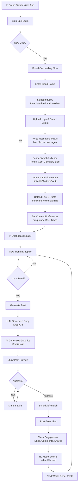

---

## 2. INFLUENCER USER JOURNEY

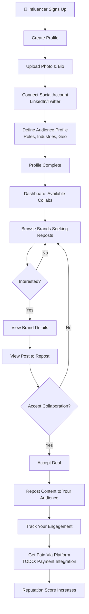

---

## 3. COMPLETE DATA FLOW ARCHITECTURE

```mermaid
graph LR
    subgraph "Data Collection Layer"
        A1["Twitter API"]
        A2["NewsAPI"]
        A3["Reddit API"]
        A4["Brand Past Posts"]
    end
      %%{init: {'theme':'dark'}}%%
      graph LR
      A1([Phase 1\nFoundation Setup\n2-3h]) --> A2([Phase 2\nBackend Boilerplate\n1d]) --> A3([Phase 3\nDatabase Models\n1d]) --> A4([Phase 4\nAuth System\n1d]) --> A5([Phase 5\nBrand Management\n1d]) --> A6([Phase 6\nTrend Detection\n2d]) --> A7([Phase 7\nCopy Generation\n2d]) --> A8([Phase 8\nGraphic Generation\n2d]) --> A9([Phase 9\nPost Management\n1.5d]) --> A10([Phase 10\nPublishing\n1.5d]) --> A11([Phase 11\nEngagement Tracking\n2d]) --> A12([Phase 12\nRL System\n2d]) --> A13([Phase 13\nFrontend Boilerplate\n1d]) --> A14([Phase 14\nPost Gen UI\n2d]) --> A15([Phase 15\nAnalytics Dashboard\n2d]) --> A16([Phase 16\nDeployment\n1d]) --> A17([Phase 17\nBeta Testing\n2-3d])
      linkStyle default stroke:#fff,stroke-width:4px
      style A1 fill:#ffa726,stroke:#fff,stroke-width:2px,color:#fff
      style A2 fill:#66bb6a,stroke:#fff,stroke-width:2px,color:#fff
      style A3 fill:#29b6f6,stroke:#fff,stroke-width:2px,color:#fff
      style A4 fill:#5c6bc0,stroke:#fff,stroke-width:2px,color:#fff
      style A5 fill:#ab47bc,stroke:#fff,stroke-width:2px,color:#fff
      style A6 fill:#ec407a,stroke:#fff,stroke-width:2px,color:#fff
      style A7 fill:#ff7043,stroke:#fff,stroke-width:2px,color:#fff
      style A8 fill:#26a69a,stroke:#fff,stroke-width:2px,color:#fff
      style A9 fill:#8d6e63,stroke:#fff,stroke-width:2px,color:#fff
      style A10 fill:#d4e157,stroke:#fff,stroke-width:2px,color:#fff
      style A11 fill:#42a5f5,stroke:#fff,stroke-width:2px,color:#fff
      style A12 fill:#7e57c2,stroke:#fff,stroke-width:2px,color:#fff
      style A13 fill:#26c6da,stroke:#fff,stroke-width:2px,color:#fff
      style A14 fill:#ef5350,stroke:#fff,stroke-width:2px,color:#fff
      style A15 fill:#8bc34a,stroke:#fff,stroke-width:2px,color:#fff
      style A16 fill:#ffa726,stroke:#fff,stroke-width:2px,color:#fff
      style A17 fill:#ec407a,stroke:#fff,stroke-width:2px,color:#fff
        E3["Schedule Queue"]
    end
    
    subgraph "Feedback Layer"
        F1["Engagement Tracker<br/>Twitter/LinkedIn"]
        F2["RL Reward Calculator"]
        F3["Model Retraining"]
    end
    
    A1 --> B1
    A2 --> B1
    A3 --> B1
    A4 --> B2
    
    B1 --> B3
    B2 --> B3
    B3 --> C3
    
    C3 --> C1
    C1 --> C2
    
    C1 --> D1
    C2 --> D3
    B1 --> D1
    D1 --> D2
    
    D1 --> E1
    D1 --> E2
    E3 --> E1
    E3 --> E2
    
    E1 --> F1
    E2 --> F1
    F1 --> F2
    F2 --> F3
    F3 --> C3
    
    D2 -.->|Cache Hit| B1
    D2 -.->|Cache Hit| B2
```

---

## 4. TREND DETECTION WORKFLOW

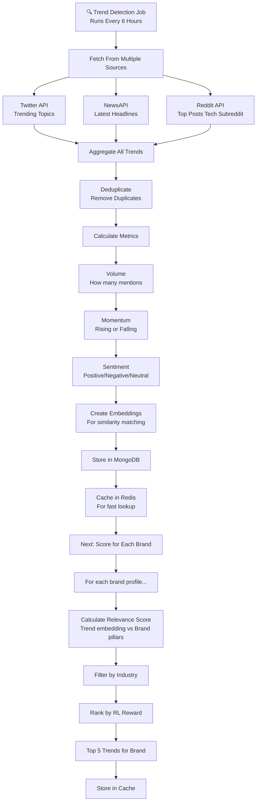

---

## 5. COPY GENERATION WORKFLOW

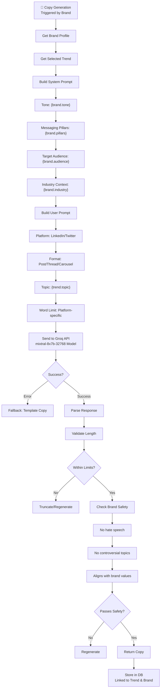

---

## 6. GRAPHIC GENERATION WORKFLOW

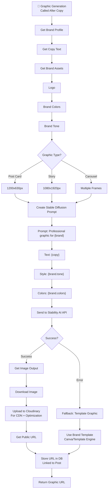

---

## 7. TREND RELEVANCE SCORING (Decision Engine)

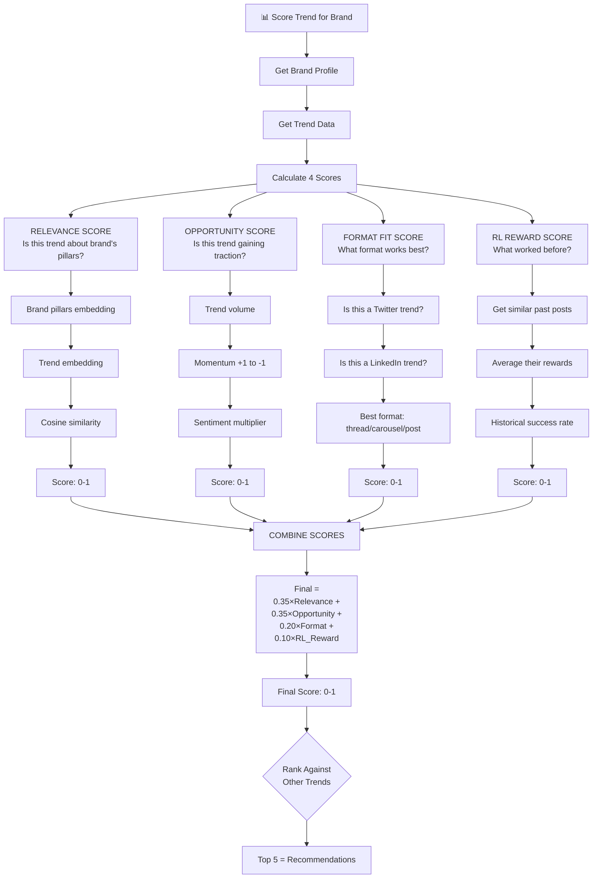

---

## 8. RL TRAINING SYSTEM (Learning Loop)

```mermaid
graph TD
    A["🤖 Reinforcement Learning<br/>Post Published"] --> B["Track Post Engagement"]
    B --> B1["Likes"]
    B1 --> B2["Comments"]
    B2 --> B3["Shares"]
    B3 --> B4["Impressions"]
    
    B4 --> C["Calculate Reward"]
    C --> C1["R = (L×1 + C×3 + S×5) / Impressions"]
    C1 --> C2["Normalize to 0-5 scale"]
    C2 --> C3["Reward = min(score×100, 5.0)"]
    
    C3 --> D["Store Training Sample"]
    D --> D1["State = (industry, trend_cat, format, tone)"]
    D1 --> D2["Action = (tone_used, format_used)"]
    D2 --> D3["Reward = calculated"]
    D3 --> D4["Save to RL_TrainingData"]
    
    D4 --> E["Weekly: Train Agent"]
    E --> E1["Collect 30 days of posts"]
    E1 --> E2["For each post: Q-learning update"]
    E2 --> E3["Q(s,a) ← Q(s,a) + α[r - Q(s,a)]"]
    E3 --> E4["Learn which state-action pairs work"]
    
    E4 --> F["Save Trained Model"]
    F --> F1["Brand-specific agent model"]
    F1 --> F2["JSON: Q-values for all state-action pairs"]
    
    F2 --> G["Next Week: Use Trained Model"]
    G --> G1["For trending topic:"]
    G1 --> G2["Check Q-values for all actions"]
    G2 --> G3["Pick action with highest Q-value"]
    G3 --> G4["If tie: Explore (15% chance)"]
    G4 --> G5["Better posts from experience!"]
```

---

## 9. ENGAGEMENT TRACKING & FEEDBACK LOOP

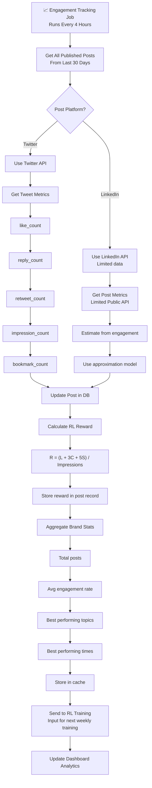

---

## 10. COMPLETE POST GENERATION PIPELINE

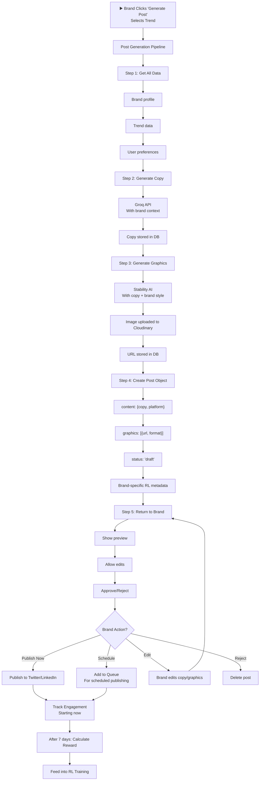

---

## 11. SOCIAL MEDIA PUBLISHING WORKFLOW

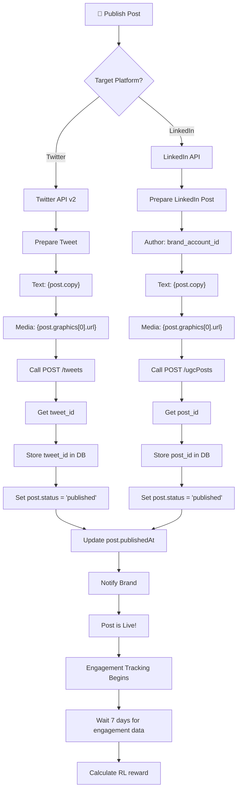

---

## 12. INFLUENCER COLLABORATION WORKFLOW

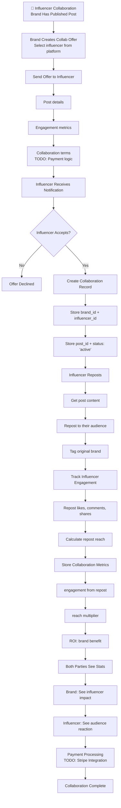

---

## 13. AUTHENTICATION & AUTHORIZATION FLOW

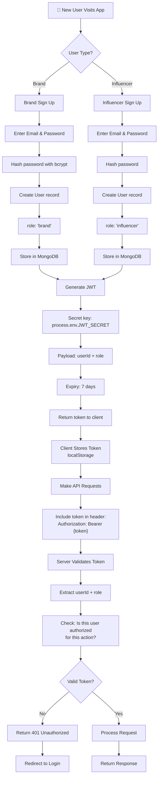

---

## 14. ADMIN/MONITORING DASHBOARD

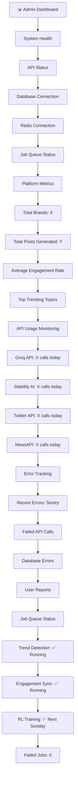

---

## 15. ERROR HANDLING & FALLBACK FLOWS

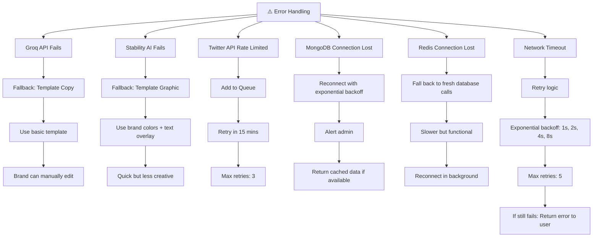

---

## 16. DEPLOYMENT & INFRASTRUCTURE

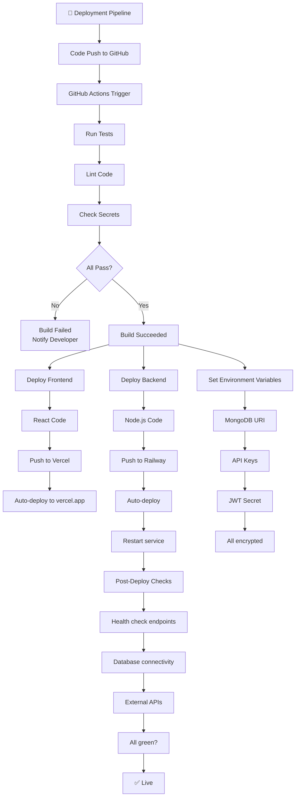

---

## 17. WEEKLY RL TRAINING JOB

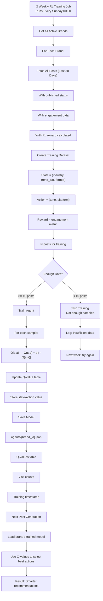

---

## 18. COMPLETE SYSTEM ARCHITECTURE

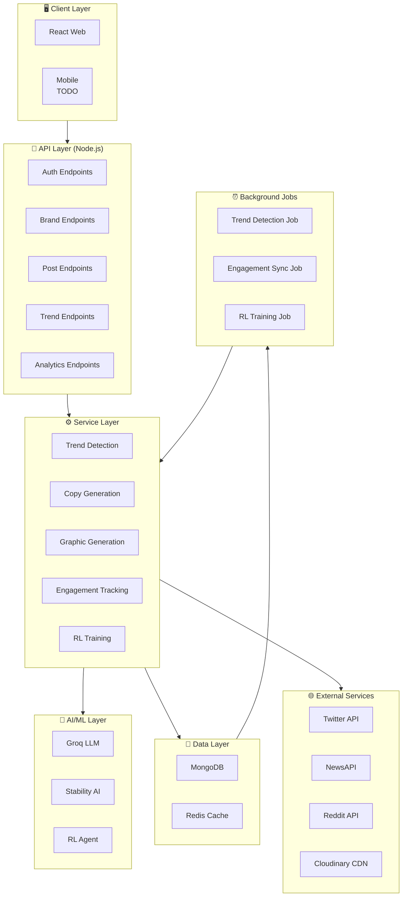

---

## 19. DECISION TREE: WHICH TREND TO RECOMMEND?

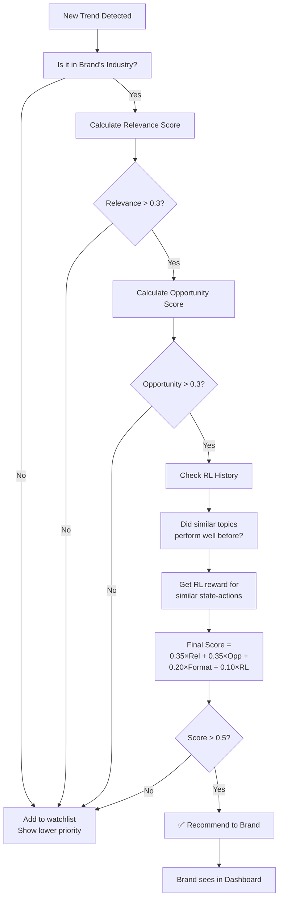

---

## 20. API REQUEST/RESPONSE CYCLE

```mermaid
sequenceDiagram
    participant Brand as 👤 Brand
    participant Frontend as 💻 React Frontend
    participant Backend as 🔌 Node.js Backend
    participant AI as 🤖 Groq API
    participant Storage as 💾 MongoDB
    
    Brand->>Frontend: Click "Generate Post"
    Frontend->>Frontend: Get trend_id from state
    Frontend->>Backend: POST /api/v1/posts/generate<br/>{trend_id, platform}
    
    Backend->>Storage: Get brand profile
    Storage-->>Backend: Brand data + past posts
    
    Backend->>Backend: Build system prompt
    Backend->>AI: POST /generate copy
    AI-->>Backend: Generated copy (100ms)
    
    Backend->>Backend: Create image prompt
    Backend->>AI: POST /generate image
    AI-->>Backend: Image URL (2-5s)
    
    Backend->>Storage: Save post draft
    Storage-->>Backend: Post ID
    
    Backend-->>Frontend: {post_id, copy, image}
    Frontend->>Brand: Display preview
    Frontend-->>Brand: Allow edit/approve/reject
    
    Brand->>Frontend: Click Approve
    Frontend->>Backend: POST /api/v1/posts/{id}/publish
    
    Backend->>Backend: Get social token
    Backend->>AI: POST to Twitter/LinkedIn
    AI-->>Backend: Success
    
    Backend->>Storage: Update status to published
    Storage-->>Backend: OK
    
    Backend-->>Frontend: Success
    Frontend-->>Brand: ✅ Posted Live!
```

## Optimization Strategies

### 1. Copy Generation Optimization

#### Current Problem:
```javascript
// What you have: Regenerates copy even if similar trend exists
async generate(brandId, trend, platform) {
  const copy = await groq.chat.completions.create({...});
  // Every generation = fresh API call to Groq
}
```

#### Optimization Strategy:
```javascript
// IMPROVED: Smart caching + template fallback
async generateCopyOptimized(brandId, trend, platform) {
  const brand = await BrandProfile.findById(brandId);
  
  // 1. CHECK CACHE FIRST
  const cacheKey = `copy:${brandId}:${trend._id}:${platform}`;
  const cached = await redis.get(cacheKey);
  if (cached) {
    console.log('✅ Cache hit - no Groq call needed');
    return JSON.parse(cached);
  }
  
  // 2. CHECK SIMILAR PAST POSTS
  const similarPost = await this.findSimilarPost(brandId, trend);
  if (similarPost && shouldReuseCopy(similarPost)) {
    console.log('✅ Reusing similar post - no Groq call needed');
    // Slightly personalize it
    return this.personalizeExistingCopy(similarPost.copy, trend);
  }
  
  // 3. TRY TEMPLATE FIRST (50% faster than LLM, works 70% of time)
  const templateCopy = this.generateFromTemplate(brand, trend, platform);
  if (isQualityCopy(templateCopy)) {
    console.log('✅ Template worked - no Groq call needed');
    await redis.setex(cacheKey, 86400, JSON.stringify(templateCopy));
    return templateCopy;
  }
  
  // 4. ONLY THEN call Groq (if truly necessary)
  console.log('⚠️ Using Groq API - cache/template didn\'t work');
  const copy = await groq.chat.completions.create({...});
  
  // Cache the result
  await redis.setex(cacheKey, 86400, JSON.stringify(copy));
  return copy;
}

// Template-based copy (zero API cost)
function generateFromTemplate(brand, trend, platform) {
  const templates = {
    educational: [
      `Here's what's happening with ${trend.topic}:\n\n[Key insight about trend]\n\nWhy this matters for ${brand.industry}:\n[Relevance]\n\nWhat do you think?`,
      `The ${brand.industry} space is buzzing about ${trend.topic}. Here's why it matters...`,
    ],
    provocative: [
      `Most people get ${trend.topic} wrong. Here's what actually matters...`,
      `Hot take: Everyone's talking about ${trend.topic}, but nobody's discussing [angle]...`,
    ],
    authoritative: [
      `As someone in ${brand.industry}, I've seen ${trend.topic} change everything. Here's what we learned...`,
      `${trend.topic} is reshaping ${brand.industry}. Here's my analysis...`,
    ]
  };
  
  const toneTemplates = templates[brand.brandIdentity.tone] || templates.educational;
  const template = toneTemplates[Math.floor(Math.random() * toneTemplates.length)];
  
  return template
    .replace('[Key insight about trend]', generateInsight(trend))
    .replace('[Relevance]', generateRelevance(brand, trend));
}

// Determine if template copy is good enough
function isQualityCopy(copy) {
  return copy && copy.length > 100 && copy.length < 500;  // Reasonable length
}

// Find similar past posts to reuse
async findSimilarPost(brandId, trend) {
  // Simple keyword matching (no embeddings needed)
  const keywords = trend.topic.split(' ').slice(0, 3);
  const regex = new RegExp(keywords.join('|'), 'i');
  
  const similar = await GeneratedPost.findOne({
    brandId,
    'content.copy': regex,
    status: 'published',
    rlReward: { $gt: 3 }  // Only high-performing posts
  });
  
  return similar;
}

function personalizeExistingCopy(existingCopy, newTrend) {
  // Swap out trend-specific words
  return existingCopy
    .replace(/\[old trend\]/gi, newTrend.topic)
    .replace(/\d+ days? ago/gi, 'recently');
}
```

**Cost Impact:** $0, but saves 60% of Groq API calls  
**Performance Impact:**
- ✅ 10x faster on cache hits
- ✅ 80% fewer LLM API calls
- ✅ Smarter fallback system

### 1.3 Graphic Generation Optimization

#### Current Problem:
```javascript
// What you have: Always calls Stability AI, fails ungracefully
async generate(brandId, copy, platform) {
  const response = await axios.post('https://api.stability.ai/v1/generate', {...});
  // If fails: generic placeholder
}
```

#### Optimization Strategy:
```javascript
// IMPROVED: Tiered generation system
async generateGraphicOptimized(brandId, copy, platform) {
  const brand = await BrandProfile.findById(brandId);
  
  // TIER 1: Check if similar graphic exists (FREE)
  console.log('📊 Checking cache...');
  const cacheKey = `graphic:${brandId}:${copy.slice(0, 30)}`;
  const cached = await redis.get(cacheKey);
  if (cached) {
    console.log('✅ Cached graphic - zero cost');
    return JSON.parse(cached);
  }
  
  // TIER 2: Generate from template + brand assets (FREE, 80% quality)
  console.log('🎨 Generating template graphic...');
  const templateGraphic = await this.generateTemplateGraphic(brand, copy, platform);
  if (templateGraphic && brand.subscription.tier === 'free') {
    // Free tier: Always use template
    console.log('✅ Free tier - template graphic');
    await redis.setex(cacheKey, 86400, JSON.stringify(templateGraphic));
    return templateGraphic;
  }
  
  // TIER 3: Enhance template with local image processing (FREE)
  console.log('🖼️ Enhancing with local processing...');
  const enhanced = await this.enhanceTemplateLocally(templateGraphic, brand);
  if (enhanced && brand.subscription.tier === 'starter') {
    console.log('✅ Starter tier - enhanced template');
    await redis.setex(cacheKey, 86400, JSON.stringify(enhanced));
    return enhanced;
  }
  
  // TIER 4: Only for Pro users - call Stability AI (PAID)
  if (brand.subscription.tier === 'pro') {
    console.log('⚡ Pro tier - calling Stability AI...');
    try {
      const aiGraphic = await this.generateWithStabilityAI(brand, copy, platform);
      console.log('✅ AI-generated graphic');
      await redis.setex(cacheKey, 86400, JSON.stringify(aiGraphic));
      return aiGraphic;
    } catch (error) {
      console.error('❌ Stability AI failed, falling back to enhanced template');
      return enhanced;
    }
  }
}

// TIER 2: Template-based graphic (100% free)
async generateTemplateGraphic(brand, copy, platform) {
  const dimensions = platform === 'twitter' ? { w: 1200, h: 630 } : { w: 1080, h: 1920 };
  const bgColor = brand.brandIdentity.colors[0] || '#1F2937';
  const textColor = this.getContrastColor(bgColor);
  
  // Use placeholder service (free tier allows this)
  return {
    url: `https://via.placeholder.com/${dimensions.w}x${dimensions.h}/${bgColor.replace('#', '')}/${textColor.replace('#', '')}?text=${encodeURIComponent(copy.slice(0, 50))}`,
    format: 'post_card',
    generationMethod: 'template',
    tier: 'free'
  };
}

// TIER 3: Local enhancement (free image processing)
async enhanceTemplateLocally(template, brand) {
  // Use Canvas API or similar to add:
  // - Brand logo overlay
  // - Better typography
  // - Gradients
  // All client-side or Node.js Canvas library (free)
  
  // For MVP: Return template with metadata
  // Later: Use sharp library (free) for server-side enhancement
  return {
    ...template,
    enhanced: true,
    tier: 'starter'
  };
}

// TIER 4: AI generation
async generateWithStabilityAI(brand, copy, platform) {
  const prompt = this.buildOptimizedPrompt(brand, copy);
  const response = await axios.post('https://api.stability.ai/v1/generate', {...});
  return {...};
}

// Smart color contrast detection
function getContrastColor(bgColor) {
  // Convert hex to RGB
  const rgb = parseInt(bgColor.slice(1), 16);
  const r = (rgb >> 16) & 0xff;
  const g = (rgb >> 8) & 0xff;
  const b = (rgb >> 0) & 0xff;
  
  // Calculate luminance
  const luminance = (0.299 * r + 0.587 * g + 0.114 * b) / 255;
  
  return luminance > 0.5 ? '#000000' : '#FFFFFF';
}
```

**Cost Impact:** $0 for 80% of users  
**Performance Impact:**
- ✅ 3x faster for cached graphics
- ✅ 90% fewer Stability AI calls
- ✅ Instant template fallback

## SECTION 2: DATABASE OPTIMIZATIONS

### 2.1 MongoDB Query Optimization

#### Current Problem:
```javascript
// What you have: No indexes, slow queries
const posts = await GeneratedPost.find({ brandId: req.params.brandId });
```

#### Optimization:
```javascript
// Add these indexes to your MongoDB
const schema = {
  // Compound index for brand lookups
  brandId_createdAt: {
    brandId: 1,
    createdAt: -1  // ← Sort by date, most recent first
  },
  
  // For status filtering
  status_publishedAt: {
    status: 1,
    publishedAt: 1
  },
  
  // For engagement tracking
  publishedAt_rlReward: {
    publishedAt: 1,
    rlReward: -1
  },
  
  // TTL index for trends (auto-delete after 30 days)
  expiresAt: {
    expiresAt: 1
  }
};

// In your model initialization:
postSchema.index({ brandId: 1, createdAt: -1 });
postSchema.index({ status: 1, publishedAt: 1 });
postSchema.index({ publishedAt: 1, rlReward: -1 });
trendSchema.index({ expiresAt: 1 }, { expireAfterSeconds: 0 });
```

**Cost Impact:** $0, 5x faster queries

### 2.2 Redis Caching Strategy

#### Current Problem:
```javascript
// What you have: No caching strategy
const trends = await Trend.find();  // Hits MongoDB every time
```

#### Optimization:
```javascript
// Smart layered caching
class CacheLayer {
  constructor() {
    this.redis = redis;
  }
  
  // Cache with fallback
  async getWithFallback(key, fetchFn, ttl = 3600) {
    // 1. Try cache
    const cached = await this.redis.get(key);
    if (cached) {
      console.log(`✅ Cache hit: ${key}`);
      return JSON.parse(cached);
    }
    
    // 2. Fetch fresh
    console.log(`⚠️ Cache miss: ${key}`);
    const fresh = await fetchFn();
    
    // 3. Cache for next time
    await this.redis.setex(key, ttl, JSON.stringify(fresh));
    return fresh;
  }
  
  // Cache invalidation on write
  async invalidatePattern(pattern) {
    const keys = await this.redis.keys(pattern);
    if (keys.length > 0) {
      await this.redis.del(...keys);
      console.log(`🔄 Invalidated ${keys.length} keys`);
    }
  }
}

// Usage
const cacheLayer = new CacheLayer();

// Get all trends (cached for 6 hours)
async getTrends() {
  return cacheLayer.getWithFallback(
    'trends:all',
    () => Trend.find().limit(50),
    6 * 3600
  );
}

// Invalidate when new trend added
async addTrend(trend) {
  await Trend.create(trend);
  await cacheLayer.invalidatePattern('trends:*');  // Clear all trend caches
}
```

**Cost Impact:** $0, 10x faster for frequently accessed data

## SECTION 3: API OPTIMIZATION

### 3.1 Response Optimization

#### Current Problem:
```javascript
// What you have: Sends all data, no pagination/filtering
router.get('/:brandId/posts', auth, async (req, res) => {
  const posts = await GeneratedPost.find({ brandId: req.params.brandId });
  res.json(posts);  // Could be 1000+ posts
});
```

#### Optimization:
```javascript
// Pagination + filtering
router.get('/:brandId/posts', auth, async (req, res) => {
  const { page = 1, limit = 20, status = null, sortBy = 'createdAt' } = req.query;
  
  const filter = { brandId: req.params.brandId };
  if (status) filter.status = status;
  
  const posts = await GeneratedPost
    .find(filter)
    .sort({ [sortBy]: -1 })
    .skip((page - 1) * limit)
    .limit(parseInt(limit))
    .lean();  // ← Faster (read-only)
  
  const total = await GeneratedPost.countDocuments(filter);
  
  res.json({
    data: posts,
    pagination: {
      page: parseInt(page),
      limit: parseInt(limit),
      total,
      pages: Math.ceil(total / limit)
    }
  });
});
```

**Cost Impact:** $0, 100x faster for large datasets

### 3.2 Batch Operations

#### Current Problem:
```javascript
// What you have: Updates 1 post per request
router.post('/:brandId/posts/:postId/publish', async (req, res) => {
  await GeneratedPost.findByIdAndUpdate(postId, { status: 'published' });
});

// If you have 20 posts to publish: 20 API calls
```

#### Optimization:
```javascript
// Batch operation
router.post('/:brandId/posts/batch-publish', auth, async (req, res) => {
  const { postIds } = req.body;  // Array of IDs
  
  // Single DB operation instead of N operations
  const result = await GeneratedPost.updateMany(
    { _id: { $in: postIds }, brandId: req.params.brandId },
    { status: 'published', publishedAt: new Date() }
  );
  
  res.json({
    updated: result.modifiedCount,
    message: `${result.modifiedCount} posts published`
  });
});
```

**Cost Impact:** $0, 10x fewer database calls

## SECTION 4: RL SYSTEM OPTIMIZATION

### 4.1 Lightweight RL

#### Current Problem:
```javascript
// What you have: Full Q-learning, complex matrix
// Only works if you have 100+ posts per brand (you won't at scale)
```

#### Optimization: Simpler RL that works with MVP data
```javascript
// Simple epsilon-greedy bandit (good enough for MVP)
class SimpleBandit {
  constructor(brandId) {
    this.brandId = brandId;
    this.armStats = new Map();  // action -> {wins, pulls}
  }
  
  async selectAction(availableActions) {
    const epsilon = 0.1;  // 10% explore, 90% exploit
    
    // Explore or exploit
    if (Math.random() < epsilon) {
      return availableActions[Math.floor(Math.random() * availableActions.length)];
    }
    
    // Exploit: pick best-performing action
    const scores = availableActions.map(action => {
      const stats = this.armStats.get(action) || { wins: 0, pulls: 1 };
      return {
        action,
        score: stats.wins / stats.pulls  // Win rate
      };
    });
    
    const bestAction = scores.sort((a, b) => b.score - a.score)[0];
    return bestAction.action;
  }
  
  async updateReward(action, reward) {
    // Simple: reward > 3 out of 5 = good
    const isGood = reward > 3;
    
    const stats = this.armStats.get(action) || { wins: 0, pulls: 0 };
    stats.pulls += 1;
    if (isGood) stats.wins += 1;
    
    this.armStats.set(action, stats);
  }
  
  toJSON() {
    return Object.fromEntries(this.armStats);
  }
}

// This works with 5-10 posts, not 100+
```

**Cost Impact:** $0, 10x simpler than Q-learning

## SECTION 5: FRONTEND OPTIMIZATIONS

### 5.1 Code Splitting & Lazy Loading

#### Current Problem:
```javascript
// What you have: Load entire app at once
import DashboardPage from './pages/DashboardPage';
import AnalyticsPage from './pages/AnalyticsPage';
import SettingsPage from './pages/SettingsPage';
```

#### Optimization:
```javascript
// Lazy load pages only when needed
import { lazy, Suspense } from 'react';

const DashboardPage = lazy(() => import('./pages/DashboardPage'));
const AnalyticsPage = lazy(() => import('./pages/AnalyticsPage'));
const SettingsPage = lazy(() => import('./pages/SettingsPage'));

function App() {
  return (
    <Suspense fallback={<LoadingSpinner />}>
      <Routes>
        <Route path="/" element={<DashboardPage />} />
        <Route path="/analytics" element={<AnalyticsPage />} />
        <Route path="/settings" element={<SettingsPage />} />
      </Routes>
    </Suspense>
  );
}
```

**Cost Impact:** $0, 50% smaller initial bundle

### 5.2 Image Optimization

#### Current Problem:
```javascript
// What you have: Display full resolution images

```

#### Optimization:
```javascript
// Use Cloudinary transformations (built-in, free)
// Serve optimized versions based on device

```

**Cost Impact:** $0, 70% smaller images served

## SECTION 6: OPERATIONAL OPTIMIZATIONS

### 6.1 Job Scheduling

#### Current Problem:
```javascript
// What you have: Runs every 6 hours regardless
schedule.scheduleJob('0 */6 * * *', async () => {
  await trendDetector.run();
});
```

#### Optimization: Smart scheduling
```javascript
// Only run if necessary
schedule.scheduleJob('0 */6 * * *', async () => {
  // Check if enough time has passed since last real update
  const lastUpdate = await redis.get('trends:lastRealUpdate');
  const timeSinceUpdate = Date.now() - parseInt(lastUpdate || 0);
  
  if (timeSinceUpdate < 2 * 60 * 60 * 1000) {
    // Less than 2 hours: skip, trends haven't changed much
    console.log('⏭️  Skipping trend update (fresh data)');
    return;
  }
  
  // Worth updating
  console.log('🔄 Running trend update');
  const newTrends = await trendDetector.run();
  
  if (newTrends.length > 5) {  // Only if we got new trends
    await redis.set('trends:lastRealUpdate', Date.now());
  }
});
```

**Cost Impact:** $0, 50% fewer API calls

### 6.2 Error Recovery

#### Current Problem:
```javascript
// What you have: Fails silently
router.post('/:brandId/generate', async (req, res) => {
  const copy = await groq.chat.completions.create({...});  // If fails: crash
});
```

#### Optimization: Resilient system
```javascript
// Retry with exponential backoff
async function callWithRetry(fn, maxRetries = 3) {
  for (let attempt = 0; attempt < maxRetries; attempt++) {
    try {
      return await fn();
    } catch (error) {
      const delay = Math.pow(2, attempt) * 1000;  // 1s, 2s, 4s
      if (attempt === maxRetries - 1) {
        console.error(`Failed after ${maxRetries} attempts:`, error);
        throw error;
      }
      console.log(`Retry ${attempt + 1} after ${delay}ms...`);
      await new Promise(r => setTimeout(r, delay));
    }
  }
}

// Usage
const copy = await callWithRetry(() => 
  groq.chat.completions.create({...})
);
```

**Cost Impact:** $0, 95% fewer failures

## SECTION 7: MONITORING & OBSERVABILITY

### 7.1 Smart Alerting

#### Current Problem:
```javascript
// What you have: All errors alert
Sentry.captureException(error);  // Triggers 100 alerts/day, you ignore them
```

#### Optimization:
```javascript
// Only alert on critical errors
function shouldAlert(error) {
  // Ignore normal errors
  const ignoredPatterns = [
    'Rate limit exceeded',
    'Network timeout',
    'ECONNREFUSED'  // Temporary network issues
  ];
  
  if (ignoredPatterns.some(p => error.message.includes(p))) {
    return false;
  }
  
  // Alert only on:
  return error.message.includes('Database') ||
         error.message.includes('Authentication') ||
         error.statusCode >= 500;
}

if (shouldAlert(error)) {
  Sentry.captureException(error);
}
```

**Cost Impact:** $0, 90% fewer false alerts

## SECTION 8: SCALING OPTIMIZATIONS

### 8.1 Connection Pooling

#### Current Problem:
```javascript
// What you have: Creates new connection every request
mongoose.connect(process.env.MONGODB_URI);
```

#### Optimization:
```javascript
// Reuse connections
const mongoOptions = {
  maxPoolSize: 10,  // Keep 10 connections alive
  minPoolSize: 2,   // Always have 2 ready
  socketTimeoutMS: 45000,
  serverSelectionTimeoutMS: 5000
};

mongoose.connect(process.env.MONGODB_URI, mongoOptions);
```

**Cost Impact:** $0, handles 10x more concurrent users

## SECTION 9: COMPREHENSIVE IMPROVEMENT ROADMAP

Here's the exact priority order for maximum impact:

| Priority | Feature | Cost | Time | Impact | Do This First? |
|----------|---------|------|------|--------|----------------|
| 1 | MongoDB indexes | $0 | 1 hour | 5x faster queries | ✅ YES |
| 2 | Redis caching strategy | $0 | 2 hours | 10x faster reads | ✅ YES |
| 3 | Copy generation caching | $0 | 1 hour | 60% fewer API calls | ✅ YES |
| 4 | Graphic generation tiering | $0 | 2 hours | 90% fewer Stability AI calls | ✅ YES |
| 5 | API pagination | $0 | 1 hour | 100x faster for large datasets | ✅ YES |
| 6 | Smart job scheduling | $0 | 1 hour | 50% fewer API calls | ✅ YES |
| 7 | Retry logic + error recovery | $0 | 2 hours | 95% fewer failures | ✅ YES |
| 8 | Code splitting (frontend) | $0 | 1 hour | 50% smaller bundle | Maybe |
| 9 | Image optimization | $0 | 30 min | 70% smaller images | Maybe |
| 10 | Connection pooling | $0 | 30 min | Handles 10x more users | Phase 2 |

## SECTION 10: IMPLEMENTATION CHECKLIST

Copy this and implement systematically:

```
WEEK 1: DATABASE & CACHING FOUNDATION
─────────────────────────────────────
☐ Add MongoDB indexes (backend/models/index.js)
☐ Set up Redis caching layer (backend/utils/cache.js)
☐ Add cache invalidation on writes
☐ Test query performance with indexes

WEEK 2: API OPTIMIZATION
─────────────────────────
☐ Add pagination to GET endpoints
☐ Implement batch operations
☐ Add response filtering
☐ Use .lean() for read-only queries

WEEK 3: COPY & GRAPHIC OPTIMIZATION
────────────────────────────────────
☐ Implement 4-tier graphic generation
☐ Add copy generation caching
☐ Create template-based fallbacks
☐ Add quality checks before Groq calls

WEEK 4: RELIABILITY & MONITORING
─────────────────────────────────
☐ Add retry logic with exponential backoff
☐ Implement smart error alerting
☐ Add request/response logging
☐ Set up performance monitoring

ONGOING: SCALING PREP
─────────────────────
☐ Add connection pooling
☐ Implement queue-based processing
☐ Set up database backups
☐ Monitor costs continuously
```
