# Bigness App: Complete Flowchart Documentation
## 21. META & GOOGLE ADS INTEGRATION FLOW

```mermaid
graph TB
    subgraph User["👤 User Dashboard"]
        A1["Login<br/>Register"]
        A2["Create Brand Profile"]
        A3["View Trends"]
    end

    subgraph Content["📝 Content Generation"]
        B1["Fetch Trends<br/>Twitter + NewsAPI"]
        B2["Generate Copy<br/>Groq LLM"]
        B3["Generate Image<br/>Stability AI"]
        B4["Create Post Draft<br/>Store in DB"]
    end

    subgraph Publishing["🚀 Publishing & Ads"]
        C1["Publish to Twitter<br/>Post to Timeline"]
        C2["Track Engagement<br/>Metrics from Twitter"]
        subgraph AdsAutomation["🎯 Ads Automation Engine"]
            C3a["Analyze Post<br/>Performance"]
            C3b["Create Ads<br/>Campaign Brief"]
            C3c["Select Ad Platform<br/>Meta or Google"]
        end
        C4a["Meta Ads Flow"]
        C4b["Google Ads Flow"]
    end

    subgraph MetaAds["📱 Meta Ads Management"]
        D1["Connect Facebook<br/>Business Account"]
        D2["Create Ad Campaign<br/>with Post Content"]
        D3["Set Targeting<br/>Age, Location, Interests"]
        D4["Set Budget &<br/>Schedule"]
        D5["Create Ads<br/>in Meta Platform"]
        D6["Monitor Performance<br/>Impressions, Clicks, ROI"]
    end

    subgraph GoogleAds["🔍 Google Ads Management"]
        E1["Connect Google<br/>Ads Account"]
        E2["Create Campaign<br/>Search/Display/Shopping"]
        E3["Extract Keywords<br/>from Post Content"]
        E4["Set Targeting &<br/>Budget"]
        E5["Create Ads<br/>in Google Platform"]
        E6["Monitor Performance<br/>Impressions, Clicks, Cost"]
    end

    subgraph Analytics["📊 Analytics Dashboard"]
        F1["Aggregate Metrics<br/>All Platforms"]
        F2["Calculate ROI<br/>Per Post + Ad"]
        F3["Show Performance<br/>Comparison"]
        F4["Recommend Optimization<br/>RL Algorithm"]
    end

    subgraph RL["🤖 Reinforcement Learning"]
        G1["Analyze Best Performing<br/>Post Formats"]
        G2["Learn Platform<br/>Preferences"]
        G3["Optimize Next<br/>Generation"]
        G4["Update Brand Profile<br/>Recommendations"]
    end

    %% User Flow
    A1 --> A2
    A2 --> A3
    A3 --> B1

    %% Content Generation Flow
    B1 --> B2
    B2 --> B3
    B3 --> B4

    %% Publishing Flow
    B4 --> C1
    C1 --> C2
    C2 --> C3a
    C3a --> C3b
    C3b --> C3c

    %% Split to Meta or Google
    C3c -->|Meta Selected| C4a
    C3c -->|Google Selected| C4b
    C3c -->|Both| C4a
    C3c -->|Both| C4b

    %% Meta Ads Flow
    C4a --> D1
    D1 --> D2
    D2 --> D3
    D3 --> D4
    D4 --> D5
    D5 --> D6

    %% Google Ads Flow
    C4b --> E1
    E1 --> E2
    E2 --> E3
    E3 --> E4
    E4 --> E5
    E5 --> E6

    %% Analytics
    D6 --> F1
    E6 --> F1
    F1 --> F2
    F2 --> F3
    F3 --> F4

    %% RL Loop
    F4 --> G1
    G1 --> G2
    G2 --> G3
    G3 --> G4
    G4 -.->|Loop Back| A3

    %% Styling
    classDef userStyle fill:#e1f5ff,stroke:#01579b,stroke-width:2px
    classDef contentStyle fill:#f3e5f5,stroke:#4a148c,stroke-width:2px
    classDef publishStyle fill:#fff3e0,stroke:#e65100,stroke-width:2px
    classDef metaStyle fill:#e8f5e9,stroke:#1b5e20,stroke-width:2px
    classDef googleStyle fill:#fce4ec,stroke:#880e4f,stroke-width:2px
    classDef analyticsStyle fill:#e0f2f1,stroke:#004d40,stroke-width:2px
    classDef rlStyle fill:#f1f8e9,stroke:#33691e,stroke-width:2px
    classDef adsAutoStyle fill:#ffe0b2,stroke:#e65100,stroke-width:2px

    class A1,A2,A3 userStyle
    class B1,B2,B3,B4 contentStyle
    class C1,C2 publishStyle
    class C3a,C3b,C3c adsAutoStyle
    class D1,D2,D3,D4,D5,D6 metaStyle
    class E1,E2,E3,E4,E5,E6 googleStyle
    class F1,F2,F3,F4 analyticsStyle
    class G1,G2,G3,G4 rlStyle
```

### 📋 Flow Explanation
**Phase 1: User & Content**
User logs in → Creates brand profile → Fetches trends

Entry point for everything

**Phase 2: Content Generation**
Trends fetched from Twitter + NewsAPI

Copy generated with Groq LLM

Images generated with Stability AI

Post saved as draft

**Phase 3: Publishing & Decision**
Post published to Twitter immediately

Metrics tracked from Twitter API

Smart Ad Automation decides: Should this post become an ad?

Platform selection: Meta, Google, or both?

**Phase 4A: Meta Ads (Facebook/Instagram)**
Connect Account → Create Campaign → Set Targeting → Set Budget → Create Ads → Monitor
Reuses post content (headline + image)

Targets by: Age, Location, Interests, Demographics

Tracks: Impressions, Clicks, Conversions, Spend

**Phase 4B: Google Ads (Search/Display)**
Connect Account → Create Campaign → Extract Keywords → Set Targeting → Create Ads → Monitor
Extracts keywords from post content

Creates search ads and/or display ads

Targets by: Keywords, Location, Demographics, Interests

Tracks: Impressions, Clicks, Cost-per-Click, Conversions

**Phase 5: Analytics & Optimization**
Aggregates metrics from all 3 platforms (Twitter + Meta + Google)

Calculates ROI per post + ad combination

Shows performance comparison

Recommends optimizations

**Phase 6: Reinforcement Learning Loop**
Analyzes best performing formats

Learns platform preferences

Updates recommendations

Loop back: Next posts get better automatically


## 1. BRAND USER JOURNEY

```mermaid
graph TD
    A["👤 Brand Owner Visits App"] --> B["Sign Up / Login"]
    B --> C{New User?}
    C -->|Yes| D["Brand Onboarding Flow"]
    C -->|No| E["Dashboard"]
    
    D --> D1["Enter Brand Name"]
    D1 --> D2["Select Industry<br/>fintech/tech/education/other"]
    D2 --> D3["Upload Logo & Brand Colors"]
    D3 --> D4["Write Messaging Pillars<br/>Max 5 core messages"]
    D4 --> D5["Define Target Audience<br/>Roles, Geo, Company Size"]
    D5 --> D6["Connect Social Accounts<br/>LinkedIn/Twitter OAuth"]
    D6 --> D7["Upload Past 5 Posts<br/>For brand voice learning"]
    D7 --> D8["Set Content Preferences<br/>Frequency, Best Times"]
    D8 --> E["✅ Dashboard Ready"]
    
    E --> F["View Trending Topics"]
    F --> G{Like a Trend?}
    G -->|Yes| H["Generate Post"]
    G -->|No| F
    
    H --> H1["LLM Generates Copy<br/>Groq API"]
    H1 --> H2["AI Generates Graphics<br/>Stability AI"]
    H2 --> H3["Show Post Preview"]
    H3 --> I{Approve?}
    I -->|Edit| J["Manual Edits"]
    J --> I
    I -->|Approve| K["Schedule/Publish"]
    K --> L["Post Goes Live"]
    L --> M["Track Engagement<br/>Likes, Comments, Shares"]
    M --> N["RL Model Learns<br/>What Worked"]
    
    N --> O["Next Week: Better Posts"]
    O --> F
```

---

## 2. INFLUENCER USER JOURNEY

```mermaid
graph TD
    A["👥 Influencer Signs Up"] --> B["Create Profile"]
    B --> B1["Upload Photo & Bio"]
    B1 --> B2["Connect Social Account<br/>LinkedIn/Twitter"]
    B2 --> B3["Define Audience Profile<br/>Roles, Industries, Geo"]
    B3 --> C["Profile Complete"]
    
    C --> D["Dashboard: Available Collabs"]
    D --> E["Browse Brands Seeking Reposts"]
    E --> F{Interested?}
    F -->|No| E
    F -->|Yes| G["View Brand Details"]
    G --> H["View Post to Repost"]
    H --> I{Accept Collaboration?}
    I -->|No| E
    I -->|Yes| J["Accept Deal"]
    J --> K["Repost Content to Your Audience"]
    K --> L["Track Your Engagement"]
    L --> M["Get Paid Via Platform<br/>TODO: Payment Integration"]
    M --> N["Reputation Score Increases"]
```

---

## 3. COMPLETE DATA FLOW ARCHITECTURE

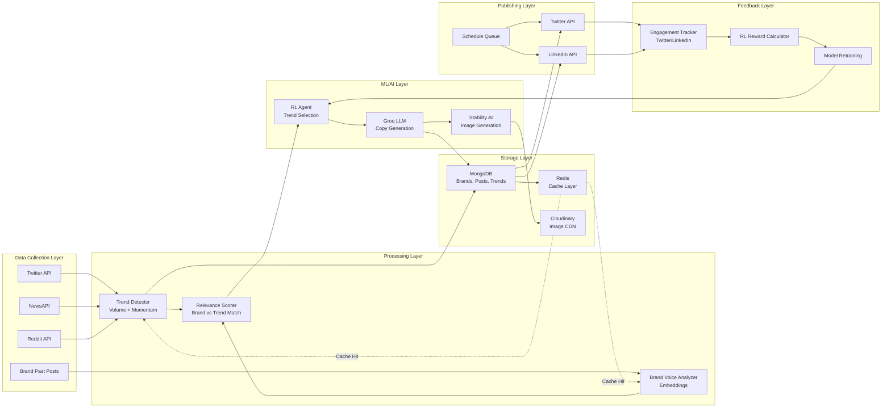

---

## 4. TREND DETECTION WORKFLOW

```mermaid
graph TD
    A["🔍 Trend Detection Job<br/>Runs Every 6 Hours"] --> B["Fetch From Multiple Sources"]
    
    B --> B1["Twitter API<br/>Trending Topics"]
    B --> B2["NewsAPI<br/>Latest Headlines"]
    B --> B3["Reddit API<br/>Top Posts Tech Subreddit"]
    
    B1 --> C["Aggregate All Trends"]
    B2 --> C
    B3 --> C
    
    C --> D["Deduplicate<br/>Remove Duplicates"]
    D --> E["Calculate Metrics"]
    
    E --> E1["Volume<br/>How many mentions"]
    E1 --> E2["Momentum<br/>Rising or Falling"]
    E2 --> E3["Sentiment<br/>Positive/Negative/Neutral"]
    
    E3 --> F["Create Embeddings<br/>For similarity matching"]
    F --> G["Store in MongoDB"]
    G --> H["Cache in Redis<br/>For fast lookup"]
    
    H --> I["Next: Score for Each Brand"]
    I --> J["For each brand profile..."]
    J --> K["Calculate Relevance Score<br/>Trend embedding vs Brand pillars"]
    K --> L["Filter by Industry"]
    L --> M["Rank by RL Reward"]
    M --> N["Top 5 Trends for Brand"]
    N --> O["Store in Cache"]
```

---

## 5. COPY GENERATION WORKFLOW

```mermaid
graph TD
    A["📝 Copy Generation<br/>Triggered by Brand"] --> B["Get Brand Profile"]
    B --> C["Get Selected Trend"]
    C --> D["Build System Prompt"]
    
    D --> D1["Tone: {brand.tone}"]
    D1 --> D2["Messaging Pillars: {brand.pillars}"]
    D2 --> D3["Target Audience: {brand.audience}"]
    D3 --> D4["Industry Context: {brand.industry}"]
    
    D4 --> E["Build User Prompt"]
    E --> E1["Platform: LinkedIn/Twitter"]
    E1 --> E2["Format: Post/Thread/Carousel"]
    E2 --> E3["Topic: {trend.topic}"]
    E3 --> E4["Word Limit: Platform-specific"]
    
    E4 --> F["Send to Groq API<br/>mixtral-8x7b-32768 Model"]
    F --> G{Success?}
    G -->|Error| H["Fallback: Template Copy"]
    G -->|Success| I["Parse Response"]
    
    I --> J["Validate Length"]
    J --> J1{Within Limits?}
    J1 -->|No| K["Truncate/Regenerate"]
    J1 -->|Yes| L["Check Brand Safety"]
    
    L --> L1["No hate speech"]
    L1 --> L2["No controversial topics"]
    L2 --> L3["Aligns with brand values"]
    
    L3 --> M{Passes Safety?}
    M -->|No| N["Regenerate"]
    M -->|Yes| O["Return Copy"]
    O --> P["Store in DB<br/>Linked to Trend & Brand"]
```

---

## 6. GRAPHIC GENERATION WORKFLOW

```mermaid
graph TD
    A["🎨 Graphic Generation<br/>Called After Copy"] --> B["Get Brand Profile"]
    B --> C["Get Copy Text"]
    C --> D["Get Brand Assets"]
    
    D --> D1["Logo"]
    D1 --> D2["Brand Colors"]
    D2 --> D3["Brand Tone"]
    
    D3 --> E{Graphic Type?}
    
    E -->|Post Card| F["1200x630px"]
    E -->|Story| G["1080x1920px"]
    E -->|Carousel| H["Multiple Frames"]
    
    F --> I["Create Stable Diffusion Prompt"]
    G --> I
    H --> I
    
    I --> I1["Prompt: Professional graphic for {brand}"]
    I1 --> I2["Text: {copy}"]
    I2 --> I3["Style: {brand.tone}"]
    I3 --> I4["Colors: {brand.colors}"]
    
    I4 --> J["Send to Stability AI API"]
    J --> K{Success?}
    
    K -->|Error| L["Fallback: Template Graphic"]
    K -->|Success| M["Get Image Output"]
    
    M --> N["Download Image"]
    N --> O["Upload to Cloudinary<br/>For CDN + Optimization"]
    O --> P["Get Public URL"]
    
    P --> Q["Store URL in DB<br/>Linked to Post"]
    Q --> R["Return Graphic URL"]
    
    L --> S["Use Brand Template<br/>Canva/Template Engine"]
    S --> Q
```

---

## 7. TREND RELEVANCE SCORING (Decision Engine)

```mermaid
graph TD
    A["📊 Score Trend for Brand"] --> B["Get Brand Profile"]
    B --> C["Get Trend Data"]
    C --> D["Calculate 4 Scores"]
    
    D --> D1["RELEVANCE SCORE<br/>Is this trend about brand's pillars?"]
    D1 --> D1A["Brand pillars embedding"]
    D1A --> D1B["Trend embedding"]
    D1B --> D1C["Cosine similarity"]
    D1C --> D1D["Score: 0-1"]
    
    D --> D2["OPPORTUNITY SCORE<br/>Is this trend gaining traction?"]
    D2 --> D2A["Trend volume"]
    D2A --> D2B["Momentum +1 to -1"]
    D2B --> D2C["Sentiment multiplier"]
    D2C --> D2D["Score: 0-1"]
    
    D --> D3["FORMAT FIT SCORE<br/>What format works best?"]
    D3 --> D3A["Is this a Twitter trend?"]
    D3A --> D3B["Is this a LinkedIn trend?"]
    D3B --> D3C["Best format: thread/carousel/post"]
    D3C --> D3D["Score: 0-1"]
    
    D --> D4["RL REWARD SCORE<br/>What worked before?"]
    D4 --> D4A["Get similar past posts"]
    D4A --> D4B["Average their rewards"]
    D4B --> D4C["Historical success rate"]
    D4C --> D4D["Score: 0-1"]
    
    D1D --> E["COMBINE SCORES"]
    D2D --> E
    D3D --> E
    D4D --> E
    
    E --> E1["Final = <br/>0.35×Relevance +<br/>0.35×Opportunity +<br/>0.20×Format +<br/>0.10×RL_Reward"]
    
    E1 --> F["Final Score: 0-1"]
    F --> G{Rank Against<br/>Other Trends}
    G --> H["Top 5 = Recommendations"]
```

---

## 8. RL TRAINING SYSTEM (Learning Loop)

```mermaid
graph TD
    A["🤖 Reinforcement Learning<br/>Post Published"] --> B["Track Post Engagement"]
    B --> B1["Likes"]
    B1 --> B2["Comments"]
    B2 --> B3["Shares"]
    B3 --> B4["Impressions"]
    
    B4 --> C["Calculate Reward"]
    C --> C1["R = (L×1 + C×3 + S×5) / Impressions"]
    C1 --> C2["Normalize to 0-5 scale"]
    C2 --> C3["Reward = min(score×100, 5.0)"]
    
    C3 --> D["Store Training Sample"]
    D --> D1["State = (industry, trend_cat, format, tone)"]
    D1 --> D2["Action = (tone_used, format_used)"]
    D2 --> D3["Reward = calculated"]
    D3 --> D4["Save to RL_TrainingData"]
    
    D4 --> E["Weekly: Train Agent"]
    E --> E1["Collect 30 days of posts"]
    E1 --> E2["For each post: Q-learning update"]
    E2 --> E3["Q(s,a) ← Q(s,a) + α[r - Q(s,a)]"]
    E3 --> E4["Learn which state-action pairs work"]
    
    E4 --> F["Save Trained Model"]
    F --> F1["Brand-specific agent model"]
    F1 --> F2["JSON: Q-values for all state-action pairs"]
    
    F2 --> G["Next Week: Use Trained Model"]
    G --> G1["For trending topic:"]
    G1 --> G2["Check Q-values for all actions"]
    G2 --> G3["Pick action with highest Q-value"]
    G3 --> G4["If tie: Explore (15% chance)"]
    G4 --> G5["Better posts from experience!"]
```

---

## 9. ENGAGEMENT TRACKING & FEEDBACK LOOP

```mermaid
graph TD
    A["📈 Engagement Tracking Job<br/>Runs Every 4 Hours"] --> B["Get All Published Posts<br/>From Last 30 Days"]
    
    B --> C{Post Platform?}
    
    C -->|Twitter| D["Use Twitter API"]
    C -->|LinkedIn| E["Use LinkedIn API<br/>Limited data"]
    
    D --> D1["Get Tweet Metrics"]
    D1 --> D2["like_count"]
    D2 --> D3["reply_count"]
    D3 --> D4["retweet_count"]
    D4 --> D5["impression_count"]
    D5 --> D6["bookmark_count"]
    
    E --> E1["Get Post Metrics<br/>Limited Public API"]
    E1 --> E2["Estimate from engagement"]
    E2 --> E3["Use approximation model"]
    
    D6 --> F["Update Post in DB"]
    E3 --> F
    
    F --> G["Calculate RL Reward"]
    G --> G1["R = (L + 3C + 5S) / Impressions"]
    G1 --> G2["Store reward in post record"]
    
    G2 --> H["Aggregate Brand Stats"]
    H --> H1["Total posts"]
    H1 --> H2["Avg engagement rate"]
    H2 --> H3["Best performing topics"]
    H3 --> H4["Best performing times"]
    H4 --> H5["Store in cache"]
    
    H5 --> I["Send to RL Training<br/>Input for next weekly training"]
    I --> J["Update Dashboard Analytics"]
```

---

## 10. COMPLETE POST GENERATION PIPELINE

```mermaid
graph TD
    A["▶️ Brand Clicks 'Generate Post'<br/>Selects Trend"] --> B["Post Generation Pipeline"]
    
    B --> C["Step 1: Get All Data"]
    C --> C1["Brand profile"]
    C1 --> C2["Trend data"]
    C2 --> C3["User preferences"]
    
    C3 --> D["Step 2: Generate Copy"]
    D --> D1["Groq API<br/>With brand context"]
    D1 --> D2["Copy stored in DB"]
    
    D2 --> E["Step 3: Generate Graphics"]
    E --> E1["Stability AI<br/>With copy + brand style"]
    E1 --> E2["Image uploaded to Cloudinary"]
    E2 --> E3["URL stored in DB"]
    
    E3 --> F["Step 4: Create Post Object"]
    F --> F1["content: {copy, platform}"]
    F1 --> F2["graphics: [{url, format}]"]
    F2 --> F3["status: 'draft'"]
    F3 --> F4["Brand-specific RL metadata"]
    
    F4 --> G["Step 5: Return to Brand"]
    G --> G1["Show preview"]
    G1 --> G2["Allow edits"]
    G2 --> G3["Approve/Reject"]
    
    G3 --> H{Brand Action?}
    H -->|Publish Now| I["Publish to Twitter/LinkedIn"]
    H -->|Schedule| J["Add to Queue<br/>For scheduled publishing"]
    H -->|Edit| K["Brand edits copy/graphics"]
    H -->|Reject| L["Delete post"]
    
    K --> G
    I --> M["Track Engagement<br/>Starting now"]
    J --> M
    M --> N["After 7 days: Calculate Reward"]
    N --> O["Feed into RL Training"]
```

---

## 11. SOCIAL MEDIA PUBLISHING WORKFLOW

```mermaid
graph TD
    A["🚀 Publish Post"] --> B{Target Platform?}
    
    B -->|Twitter| C["Twitter API v2"]
    B -->|LinkedIn| D["LinkedIn API"]
    
    C --> C1["Prepare Tweet"]
    C1 --> C2["Text: {post.copy}"]
    C2 --> C3["Media: {post.graphics[0].url}"]
    C3 --> C4["Call POST /tweets"]
    C4 --> C5["Get tweet_id"]
    C5 --> C6["Store tweet_id in DB"]
    C6 --> C7["Set post.status = 'published'"]
    
    D --> D1["Prepare LinkedIn Post"]
    D1 --> D2["Author: brand_account_id"]
    D2 --> D3["Text: {post.copy}"]
    D3 --> D4["Media: {post.graphics[0].url}"]
    D4 --> D5["Call POST /ugcPosts"]
    D5 --> D6["Get post_id"]
    D6 --> D7["Store post_id in DB"]
    D7 --> D8["Set post.status = 'published'"]
    
    C7 --> E["Update post.publishedAt"]
    D8 --> E
    
    E --> F["Notify Brand"]
    F --> G["Post is Live!"]
    G --> H["Engagement Tracking Begins"]
    H --> I["Wait 7 days for engagement data"]
    I --> J["Calculate RL reward"]
```

---

## 12. INFLUENCER COLLABORATION WORKFLOW

```mermaid
graph TD
    A["🤝 Influencer Collaboration<br/>Brand Has Published Post"] --> B["Brand Creates Collab Offer<br/>Select influencer from platform"]
    
    B --> C["Send Offer to Influencer"]
    C --> C1["Post details"]
    C1 --> C2["Engagement metrics"]
    C2 --> C3["Collaboration terms<br/>TODO: Payment logic"]
    
    C3 --> D["Influencer Receives Notification"]
    D --> E{Influencer Accepts?}
    
    E -->|No| F["Offer Declined"]
    E -->|Yes| G["Create Collaboration Record"]
    
    G --> G1["Store brand_id + influencer_id"]
    G1 --> G2["Store post_id + status: 'active'"]
    
    G2 --> H["Influencer Reposts"]
    H --> H1["Get post content"]
    H1 --> H2["Repost to their audience"]
    H2 --> H3["Tag original brand"]
    
    H3 --> I["Track Influencer Engagement"]
    I --> I1["Repost likes, comments, shares"]
    I1 --> I2["Calculate repost reach"]
    
    I2 --> J["Store Collaboration Metrics"]
    J --> J1["engagement from repost"]
    J1 --> J2["reach multiplier"]
    J2 --> J3["ROI: brand benefit"]
    
    J3 --> K["Both Parties See Stats"]
    K --> K1["Brand: See influencer impact"]
    K1 --> K2["Influencer: See audience reaction"]
    
    K2 --> L["Payment Processing<br/>TODO: Stripe Integration"]
    L --> M["Collaboration Complete"]
```

---

## 13. AUTHENTICATION & AUTHORIZATION FLOW

```mermaid
graph TD
    A["👤 New User Visits App"] --> B{User Type?}
    
    B -->|Brand| C["Brand Sign Up"]
    B -->|Influencer| D["Influencer Sign Up"]
    
    C --> C1["Enter Email & Password"]
    C1 --> C2["Hash password with bcrypt"]
    C2 --> C3["Create User record"]
    C3 --> C4["role: 'brand'"]
    C4 --> C5["Store in MongoDB"]
    
    D --> D1["Enter Email & Password"]
    D1 --> D2["Hash password"]
    D2 --> D3["Create User record"]
    D3 --> D4["role: 'influencer'"]
    D4 --> D5["Store in MongoDB"]
    
    C5 --> E["Generate JWT"]
    D5 --> E
    
    E --> E1["Secret key: process.env.JWT_SECRET"]
    E1 --> E2["Payload: userId + role"]
    E2 --> E3["Expiry: 7 days"]
    E3 --> E4["Return token to client"]
    
    E4 --> F["Client Stores Token<br/>localStorage"]
    F --> G["Make API Requests"]
    G --> G1["Include token in header:<br/>Authorization: Bearer {token}"]
    
    G1 --> H["Server Validates Token"]
    H --> H1["Extract userId + role"]
    H1 --> H2["Check: Is this user authorized<br/>for this action?"]
    
    H2 --> I{Valid Token?}
    I -->|No| J["Return 401 Unauthorized"]
    I -->|Yes| K["Process Request"]
    K --> L["Return Response"]
    
    J --> M["Redirect to Login"]
```

---

## 14. ADMIN/MONITORING DASHBOARD

```mermaid
graph TD
    A["📊 Admin Dashboard"] --> B["System Health"]
    
    B --> B1["API Status"]
    B1 --> B2["Database Connection"]
    B2 --> B3["Redis Connection"]
    B3 --> B4["Job Queue Status"]
    
    B4 --> C["Platform Metrics"]
    C --> C1["Total Brands: X"]
    C1 --> C2["Total Posts Generated: Y"]
    C2 --> C3["Average Engagement Rate"]
    C3 --> C4["Top Trending Topics"]
    
    C4 --> D["API Usage Monitoring"]
    D --> D1["Groq API: X calls today"]
    D1 --> D2["Stability AI: X calls today"]
    D2 --> D3["Twitter API: X calls today"]
    D3 --> D4["NewsAPI: X calls today"]
    
    D4 --> E["Error Tracking"]
    E --> E1["Recent Errors: Sentry"]
    E1 --> E2["Failed API Calls"]
    E2 --> E3["Database Errors"]
    E3 --> E4["User Reports"]
    
    E4 --> F["Job Queue Status"]
    F --> F1["Trend Detection: ✅ Running"]
    F1 --> F2["Engagement Sync: ✅ Running"]
    F2 --> F3["RL Training: ✅ Next Sunday"]
    F3 --> F4["Failed Jobs: 0"]
```

---

## 15. ERROR HANDLING & FALLBACK FLOWS

```mermaid
graph TD
    A["⚠️ Error Handling"] --> B["Groq API Fails"]
    B --> B1["Fallback: Template Copy"]
    B1 --> B2["Use basic template"]
    B2 --> B3["Brand can manually edit"]
    
    A --> C["Stability AI Fails"]
    C --> C1["Fallback: Template Graphic"]
    C1 --> C2["Use brand colors + text overlay"]
    C2 --> C3["Quick but less creative"]
    
    A --> D["Twitter API Rate Limited"]
    D --> D1["Add to Queue"]
    D1 --> D2["Retry in 15 mins"]
    D2 --> D3["Max retries: 3"]
    
    A --> E["MongoDB Connection Lost"]
    E --> E1["Reconnect with exponential backoff"]
    E1 --> E2["Alert admin"]
    E2 --> E3["Return cached data if available"]
    
    A --> F["Redis Connection Lost"]
    F --> F1["Fall back to fresh database calls"]
    F1 --> F2["Slower but functional"]
    F2 --> F3["Reconnect in background"]
    
    A --> G["Network Timeout"]
    G --> G1["Retry logic"]
    G1 --> G2["Exponential backoff: 1s, 2s, 4s, 8s"]
    G2 --> G3["Max retries: 5"]
    G3 --> G4["If still fails: Return error to user"]
```

---

## 16. DEPLOYMENT & INFRASTRUCTURE

```mermaid
graph TD
    A["🚀 Deployment Pipeline"] --> B["Code Push to GitHub"]
    B --> C["GitHub Actions Trigger"]
    
    C --> C1["Run Tests"]
    C1 --> C2["Lint Code"]
    C2 --> C3["Check Secrets"]
    
    C3 --> D{All Pass?}
    D -->|No| E["Build Failed<br/>Notify Developer"]
    D -->|Yes| F["Build Succeeded"]
    
    F --> G["Deploy Frontend"]
    G --> G1["React Code"]
    G1 --> G2["Push to Vercel"]
    G2 --> G3["Auto-deploy to vercel.app"]
    
    F --> H["Deploy Backend"]
    H --> H1["Node.js Code"]
    H1 --> H2["Push to Railway"]
    H2 --> H3["Auto-deploy"]
    H3 --> H4["Restart service"]
    
    F --> I["Set Environment Variables"]
    I --> I1["MongoDB URI"]
    I1 --> I2["API Keys"]
    I2 --> I3["JWT Secret"]
    I3 --> I4["All encrypted"]
    
    H4 --> J["Post-Deploy Checks"]
    J --> J1["Health check endpoints"]
    J1 --> J2["Database connectivity"]
    J2 --> J3["External APIs"]
    J3 --> J4["All green?"]
    
    J4 --> K["✅ Live"]
```

---

## 17. WEEKLY RL TRAINING JOB

```mermaid
graph TD
    A["🔄 Weekly RL Training Job<br/>Runs Every Sunday 00:00"] --> B["Get All Active Brands"]
    B --> C["For Each Brand:"]
    
    C --> C1["Fetch All Posts (Last 30 Days)"]
    C1 --> C2["With published status"]
    C2 --> C3["With engagement data"]
    C3 --> C4["With RL reward calculated"]
    
    C4 --> D["Create Training Dataset"]
    D --> D1["State = (industry, trend, format)"]
    D1 --> D2["Action = (tone, platform)"]
    D2 --> D3["Reward = engagement metric"]
    D3 --> D4["N posts for training"]
    
    D4 --> E{Enough Data?}
    E -->|< 10 posts| F["Skip Training<br/>Not enough samples"]
    E -->|>= 10 posts| G["Train Agent"]
    
    G --> G1["For each sample:"]
    G1 --> G2["Q(s,a) ← Q(s,a) + α[r - Q(s,a)]"]
    G2 --> G3["Update Q-value table"]
    G3 --> G4["Store state-action value"]
    
    G4 --> H["Save Model"]
    H --> H1["agents/{brand_id}.json"]
    H1 --> H2["Q-values table"]
    H2 --> H3["Visit counts"]
    H3 --> H4["Training timestamp"]
    
    H4 --> I["Next Post Generation"]
    I --> I1["Load brand's trained model"]
    I1 --> I2["Use Q-values to select best actions"]
    I2 --> I3["Result: Smarter recommendations"]
    
    F --> J["Log: Insufficient data"]
    J --> K["Next week: try again"]
```

---

## 18. COMPLETE SYSTEM ARCHITECTURE

```mermaid
graph TB
    subgraph Client["🖥️ Client Layer"]
        A1["React Web"]
        A2["Mobile<br/>TODO"]
    end
    
    subgraph API["🔌 API Layer (Node.js)"]
        B1["Auth Endpoints"]
        B2["Brand Endpoints"]
        B3["Post Endpoints"]
        B4["Trend Endpoints"]
        B5["Analytics Endpoints"]
    end
    
    subgraph Services["⚙️ Service Layer"]
        C1["Trend Detection"]
        C2["Copy Generation"]
        C3["Graphic Generation"]
        C4["Engagement Tracking"]
        C5["RL Training"]
    end
    
    subgraph AI["🤖 AI/ML Layer"]
        D1["Groq LLM"]
        D2["Stability AI"]
        D3["RL Agent"]
    end
    
    subgraph Data["💾 Data Layer"]
        E1["MongoDB"]
        E2["Redis Cache"]
    end
    
    subgraph External["🌐 External Services"]
        F1["Twitter API"]
        F2["NewsAPI"]
        F3["Reddit API"]
        F4["Cloudinary CDN"]
    end
    
    subgraph Jobs["⏰ Background Jobs"]
        G1["Trend Detection Job"]
        G2["Engagement Sync Job"]
        G3["RL Training Job"]
    end
    
    Client --> API
    API --> Services
    Services --> AI
    Services --> Data
    Services --> External
    Data --> Jobs
    Jobs --> Services
```

---

## 19. DECISION TREE: WHICH TREND TO RECOMMEND?

```mermaid
graph TD
    A["New Trend Detected"] --> B["Is it in Brand's Industry?"]
    B -->|No| C["Skip"]
    B -->|Yes| D["Calculate Relevance Score"]
    
    D --> D1{Relevance > 0.3?}
    D1 -->|No| C
    D1 -->|Yes| E["Calculate Opportunity Score"]
    
    E --> E1{Opportunity > 0.3?}
    E1 -->|No| C
    E1 -->|Yes| F["Check RL History"]
    
    F --> F1["Did similar topics<br/>perform well before?"]
    F1 --> F2["Get RL reward for<br/>similar state-actions"]
    
    F2 --> G["Final Score =<br/>0.35×Rel + 0.35×Opp +<br/>0.20×Format + 0.10×RL"]
    
    G --> H{Score > 0.5?}
    H -->|No| C["Add to watchlist<br/>Show lower priority"]
    H -->|Yes| I["✅ Recommend to Brand"]
    I --> J["Brand sees in Dashboard"]
```

---

## 20. API REQUEST/RESPONSE CYCLE

```mermaid
sequenceDiagram
    participant Brand as 👤 Brand
    participant Frontend as 💻 React Frontend
    participant Backend as 🔌 Node.js Backend
    participant AI as 🤖 Groq API
    participant Storage as 💾 MongoDB
    
    Brand->>Frontend: Click "Generate Post"
    Frontend->>Frontend: Get trend_id from state
    Frontend->>Backend: POST /api/v1/posts/generate<br/>{trend_id, platform}
    
    Backend->>Storage: Get brand profile
    Storage-->>Backend: Brand data + past posts
    
    Backend->>Backend: Build system prompt
    Backend->>AI: POST /generate copy
    AI-->>Backend: Generated copy (100ms)
    
    Backend->>Backend: Create image prompt
    Backend->>AI: POST /generate image
    AI-->>Backend: Image URL (2-5s)
    
    Backend->>Storage: Save post draft
    Storage-->>Backend: Post ID
    
    Backend-->>Frontend: {post_id, copy, image}
    Frontend->>Brand: Display preview
    Frontend-->>Brand: Allow edit/approve/reject
    
    Brand->>Frontend: Click Approve
    Frontend->>Backend: POST /api/v1/posts/{id}/publish
    
    Backend->>Backend: Get social token
    Backend->>AI: POST to Twitter/LinkedIn
    AI-->>Backend: Success
    
    Backend->>Storage: Update status to published
    Storage-->>Backend: OK
    
    Backend-->>Frontend: Success
    Frontend-->>Brand: ✅ Posted Live!
```

